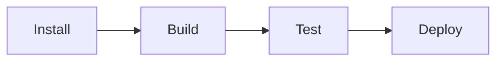
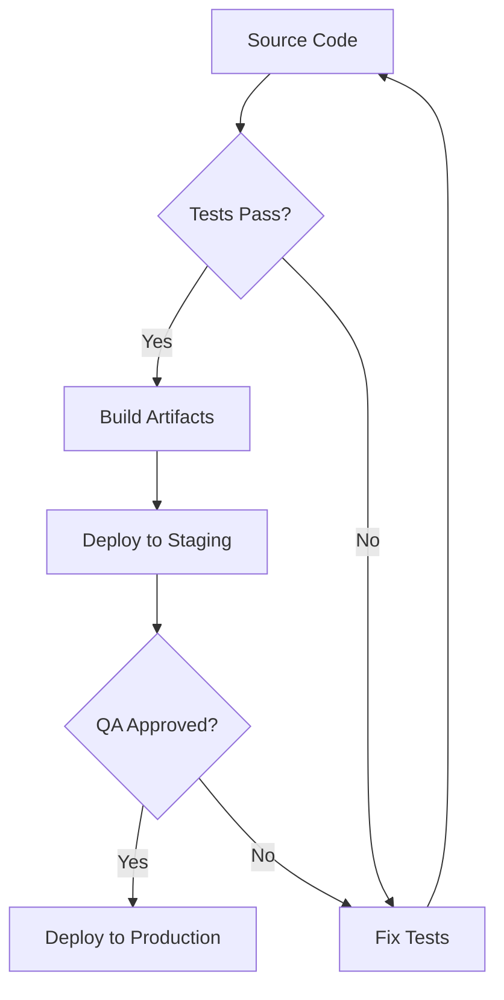
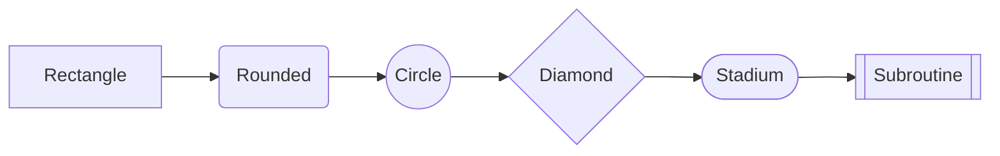
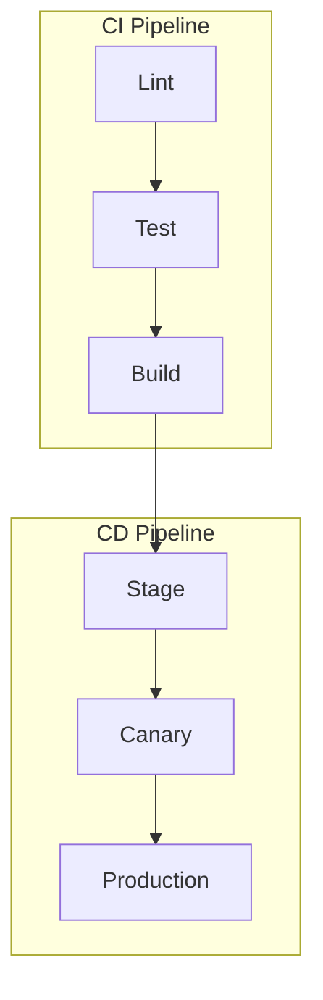
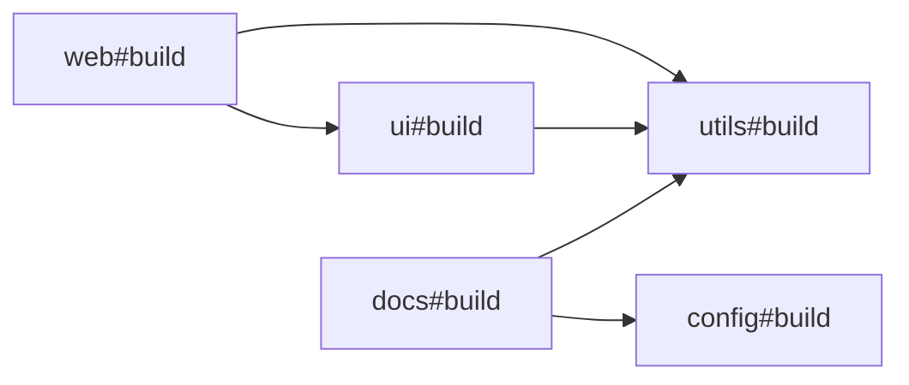
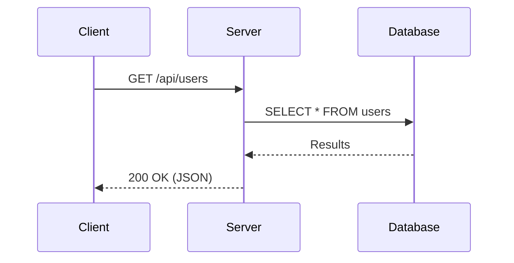
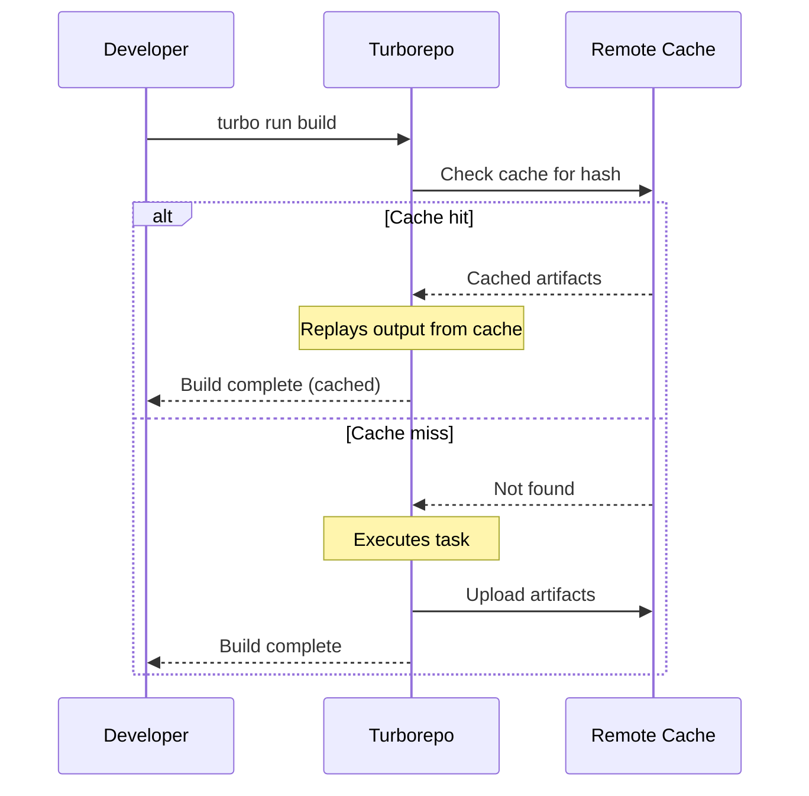
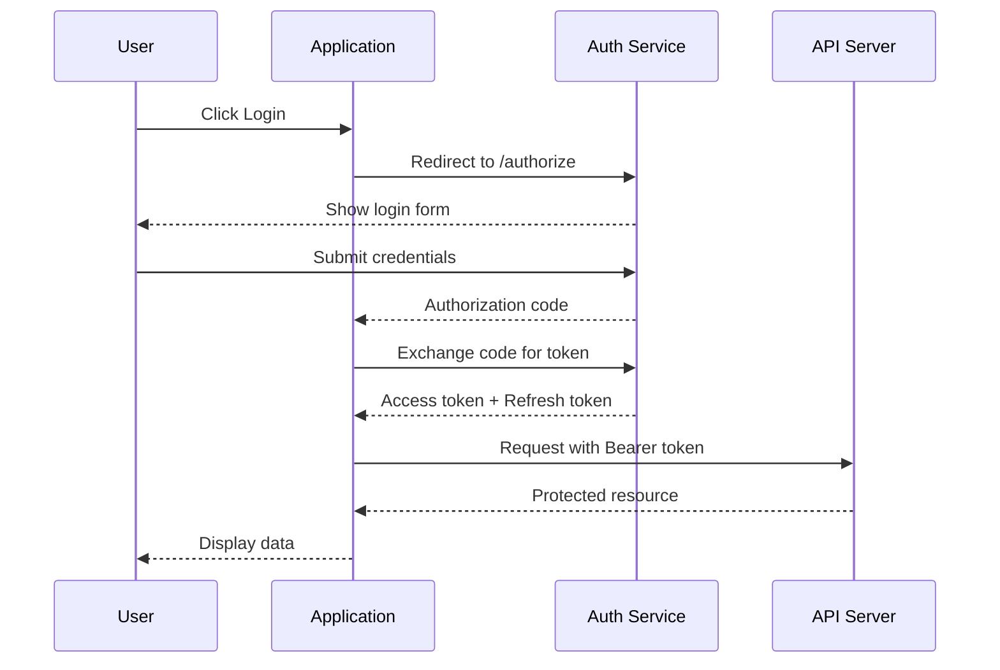

# Diagram Examples

These are example diagrams using the mermaid syntax, rendered by our custom reactflow-based components.

## Flowcharts

### Simple left-to-right

### Top-down with labels

### Node shapes

### Subgraphs

### Turbo task graph

## Sequence Diagrams

### Basic request/response

### With notes and loops

### Authentication flow

