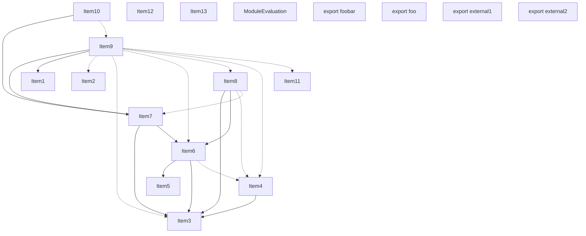
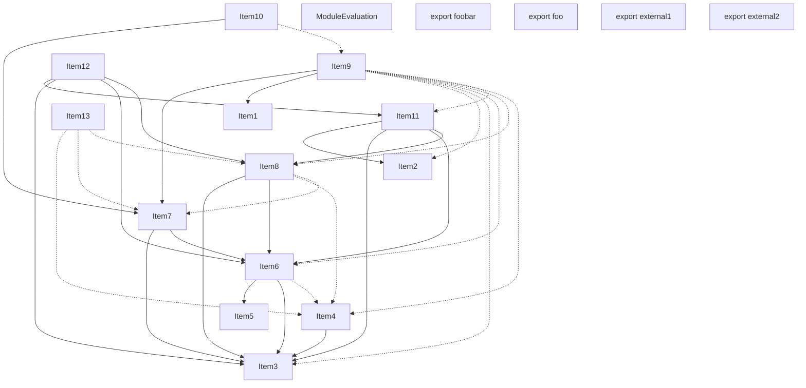
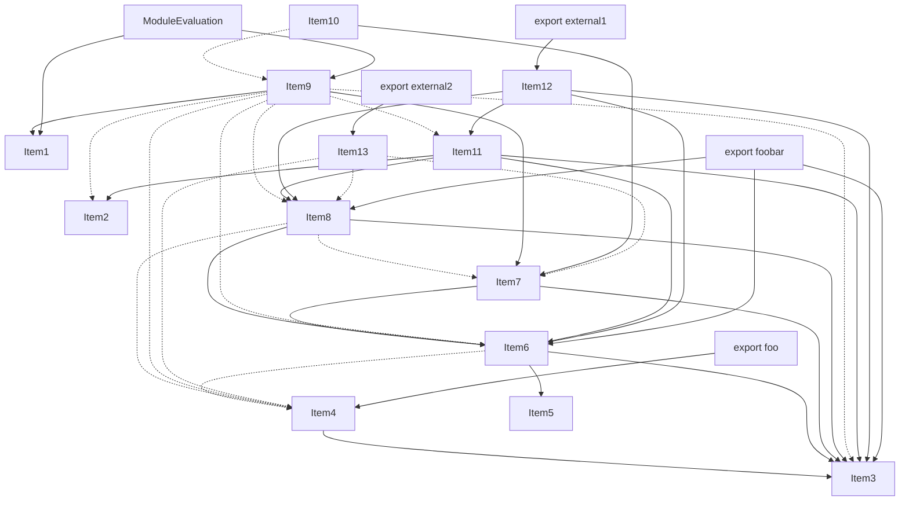
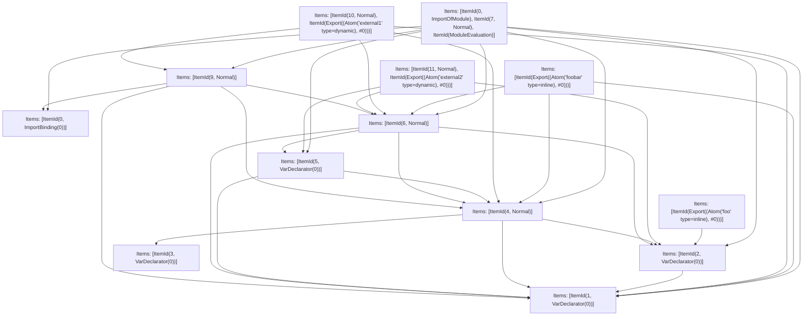

# Items

Count: 18

## Item 1: Stmt 0, `ImportOfModule`

```js
import { upper } from "module";
```

- Hoisted
- Side effects

## Item 2: Stmt 0, `ImportBinding(0)`

```js
import { upper } from "module";
```

- Hoisted
- Declares: "`upper`"

## Item 3: Stmt 1, `VarDeclarator(0)`

```js
export let foobar = "foo";
```

- Declares: "`foobar`"
- Write: "`foobar`"

## Item 4: Stmt 2, `VarDeclarator(0)`

```js
export const foo = foobar;
```

- Declares: "`foo`"
- Reads: "`foobar`"
- Write: "`foo`"

## Item 5: Stmt 3, `VarDeclarator(0)`

```js
const bar = "bar";
```

- Declares: "`bar`"
- Write: "`bar`"

## Item 6: Stmt 4, `Normal`

```js
foobar += bar;
```

- Reads: "`bar`, `foobar`"
- Write: "`foobar`"

## Item 7: Stmt 5, `VarDeclarator(0)`

```js
let foobarCopy = foobar;
```

- Declares: "`foobarCopy`"
- Reads: "`foobar`"
- Write: "`foobarCopy`"

## Item 8: Stmt 6, `Normal`

```js
foobar += "foo";
```

- Reads: "`foobar`"
- Write: "`foobar`"

## Item 9: Stmt 7, `Normal`

```js
console.log(foobarCopy);
```

- Side effects
- Reads: "`console`, `foobarCopy`"

## Item 10: Stmt 8, `Normal`

```js
foobarCopy += "Unused";
```

- Reads: "`foobarCopy`"
- Write: "`foobarCopy`"

## Item 11: Stmt 9, `Normal`

```js
function internal() {
  return upper(foobar);
}
```

- Hoisted
- Declares: "`internal`"
- Reads (eventual): "`upper`, `foobar`"

## Item 12: Stmt 10, `Normal`

```js
export function external1() {
  return internal() + foobar;
}
```

- Hoisted
- Declares: "`external1`"
- Reads (eventual): "`internal`, `foobar`"

## Item 13: Stmt 11, `Normal`

```js
export function external2() {
  foobar += ".";
}
```

- Hoisted
- Declares: "`external2`"
- Write (eventual): "`foobar`"

# Phase 1


# Phase 2



# Phase 3



# Phase 4



# Final



# Modules (dev)

## Module 1

```js
import "entry.js" assert {
    __turbopack_chunk__: 10
};
import "entry.js" assert {
    __turbopack_chunk__: 5
};
import "entry.js" assert {
    __turbopack_chunk__: 6
};
import "entry.js" assert {
    __turbopack_chunk__: 9
};
import "entry.js" assert {
    __turbopack_chunk__: 11
};
import "entry.js" assert {
    __turbopack_chunk__: 7
};
import "entry.js" assert {
    __turbopack_chunk__: 12
};
import "module";
console.log(foobarCopy);
"module evaluation";

```

## Module 2

```js
import "entry.js" assert {
    __turbopack_chunk__: 6
};
import "entry.js" assert {
    __turbopack_chunk__: 9
};
import "entry.js" assert {
    __turbopack_chunk__: 11
};
export { foobar };

```

## Module 3

```js
import "entry.js" assert {
    __turbopack_chunk__: 7
};
export { foo };

```

## Module 4

```js
import "entry.js" assert {
    __turbopack_chunk__: 12
};
import "entry.js" assert {
    __turbopack_chunk__: 6
};
import "entry.js" assert {
    __turbopack_chunk__: 9
};
import "entry.js" assert {
    __turbopack_chunk__: 11
};
export function external1() {
    return internal() + foobar;
}
export { external1 };

```

## Module 5

```js
import "entry.js" assert {
    __turbopack_chunk__: 7
};
import "entry.js" assert {
    __turbopack_chunk__: 10
};
import "entry.js" assert {
    __turbopack_chunk__: 11
};
export function external2() {
    foobar += ".";
}
export { external2 };

```

## Module 6

```js
import { upper } from "module";
```

## Module 7

```js
export let foobar = "foo";
```

## Module 8

```js
import "entry.js" assert {
    __turbopack_chunk__: 6
};
export const foo = foobar;

```

## Module 9

```js
const bar = "bar";
```

## Module 10

```js
import "entry.js" assert {
    __turbopack_chunk__: 8
};
import "entry.js" assert {
    __turbopack_chunk__: 6
};
import "entry.js" assert {
    __turbopack_chunk__: 7
};
foobar += bar;

```

## Module 11

```js
import "entry.js" assert {
    __turbopack_chunk__: 6
};
import "entry.js" assert {
    __turbopack_chunk__: 9
};
let foobarCopy = foobar;

```

## Module 12

```js
import "entry.js" assert {
    __turbopack_chunk__: 6
};
import "entry.js" assert {
    __turbopack_chunk__: 9
};
import "entry.js" assert {
    __turbopack_chunk__: 7
};
import "entry.js" assert {
    __turbopack_chunk__: 10
};
foobar += "foo";

```

## Module 13

```js
import "entry.js" assert {
    __turbopack_chunk__: 5
};
import "entry.js" assert {
    __turbopack_chunk__: 6
};
import "entry.js" assert {
    __turbopack_chunk__: 9
};
import "entry.js" assert {
    __turbopack_chunk__: 11
};
function internal() {
    return upper(foobar);
}

```

## Merged (module eval)

```js
export let foobar = "foo";
const bar = "bar";
export const foo = foobar;
foobar += bar;
let foobarCopy = foobar;
import { upper } from "module";
foobar += "foo";
function internal() {
  return upper(foobar);
}
import "module";
console.log(foobarCopy);
("module evaluation");
```

# Modules (prod)

## Module 1

```js
import "entry.js" assert {
    __turbopack_chunk__: 5
};
import "entry.js" assert {
    __turbopack_chunk__: 7
};
import "module";
let foobarCopy = foobar;
console.log(foobarCopy);
"module evaluation";

```

## Module 2

```js
import "entry.js" assert {
    __turbopack_chunk__: 5
};
import "entry.js" assert {
    __turbopack_chunk__: 7
};
import "entry.js" assert {
    __turbopack_chunk__: 8
};
export { foobar };

```

## Module 3

```js
import "entry.js" assert {
    __turbopack_chunk__: 5
};
export const foo = foobar;
export { foo };

```

## Module 4

```js
import "entry.js" assert {
    __turbopack_chunk__: 5
};
import "entry.js" assert {
    __turbopack_chunk__: 7
};
import "entry.js" assert {
    __turbopack_chunk__: 8
};
import { upper } from "module";
function internal() {
    return upper(foobar);
}
export function external1() {
    return internal() + foobar;
}
export { external1 };

```

## Module 5

```js
export function external2() {
  foobar += ".";
}
export { external2 };
```

## Module 6

```js
export let foobar = "foo";
```

## Module 7

```js
const bar = "bar";
```

## Module 8

```js
import "entry.js" assert {
    __turbopack_chunk__: 6
};
import "entry.js" assert {
    __turbopack_chunk__: 5
};
foobar += bar;

```

## Module 9

```js
import "entry.js" assert {
    __turbopack_chunk__: 5
};
import "entry.js" assert {
    __turbopack_chunk__: 7
};
foobar += "foo";

```

## Merged (module eval)

```js
export let foobar = "foo";
const bar = "bar";
foobar += bar;
import "module";
let foobarCopy = foobar;
console.log(foobarCopy);
("module evaluation");
```
