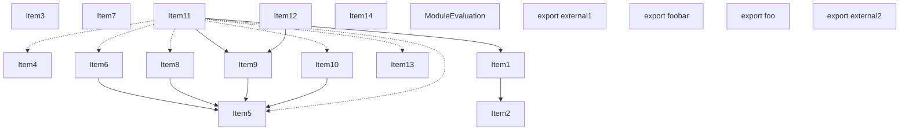
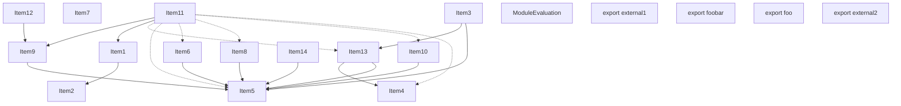
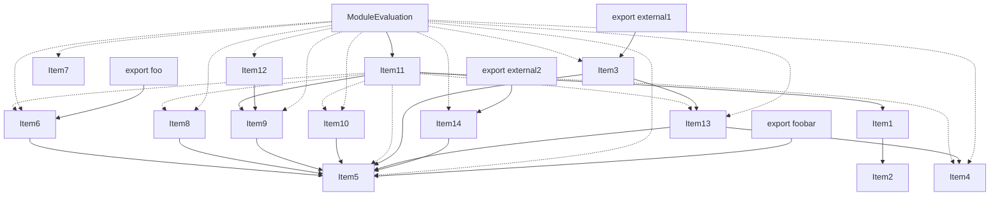

# Items

Count: 19

## Item 1: Stmt 0, `Normal`

```js
export function external1() {
  return internal() + foobar;
}
```

- Hoisted
- Declares: "`external1`"
- Reads (eventual): "`internal`, `foobar`"

## Item 2: Stmt 1, `ImportOfModule`

```js
import { upper } from "module";
```

- Hoisted
- Side effects

## Item 3: Stmt 1, `ImportBinding(0)`

```js
import { upper } from "module";
```

- Hoisted
- Declares: "`upper`"

## Item 4: Stmt 2, `VarDeclarator(0)`

```js
export let foobar = "foo";
```

- Declares: "`foobar`"
- Write: "`foobar`"

## Item 5: Stmt 3, `VarDeclarator(0)`

```js
export const foo = foobar;
```

- Declares: "`foo`"
- Reads: "`foobar`"
- Write: "`foo`"

## Item 6: Stmt 4, `VarDeclarator(0)`

```js
const bar = "bar";
```

- Declares: "`bar`"
- Write: "`bar`"

## Item 7: Stmt 5, `Normal`

```js
foobar += bar;
```

- Reads: "`foobar`"

## Item 8: Stmt 6, `VarDeclarator(0)`

```js
let foobarCopy = foobar;
```

- Declares: "`foobarCopy`"
- Reads: "`foobar`"
- Write: "`foobarCopy`"

## Item 9: Stmt 7, `Normal`

```js
foobar += "foo";
```

- Reads: "`foobar`"

## Item 10: Stmt 8, `Normal`

```js
console.log(foobarCopy);
```

- Side effects
- Reads: "`console`, `foobarCopy`"

## Item 11: Stmt 9, `Normal`

```js
foobarCopy += "Unused";
```

- Reads: "`foobarCopy`"

## Item 12: Stmt 10, `Normal`

```js
function internal() {
  return upper(foobar);
}
```

- Hoisted
- Declares: "`internal`"
- Reads (eventual): "`upper`, `foobar`"

## Item 13: Stmt 11, `Normal`

```js
export function external2() {
  foobar += ".";
}
```

- Hoisted
- Declares: "`external2`"
- Reads (eventual): "`foobar`"

## Item 14: Stmt 12, `ImportOfModule`

```js
import "other";
```

- Hoisted
- Side effects

# Phase 1


# Phase 2



# Phase 3



# Phase 4


