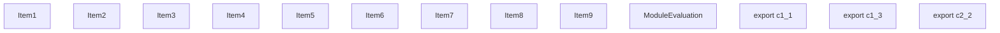
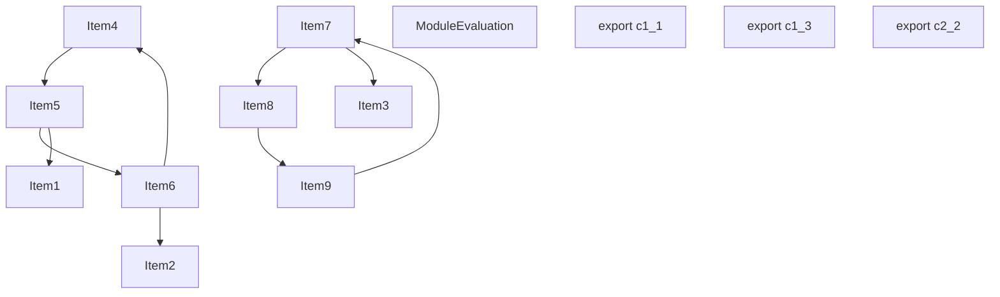
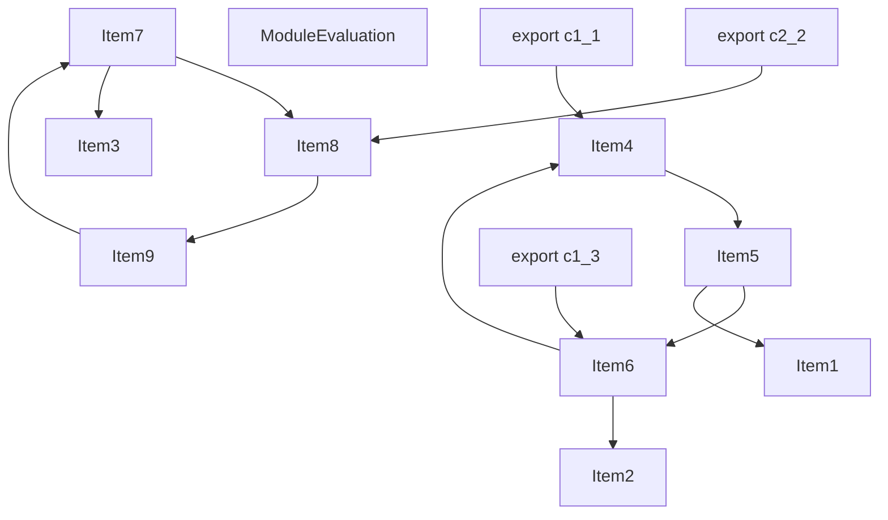
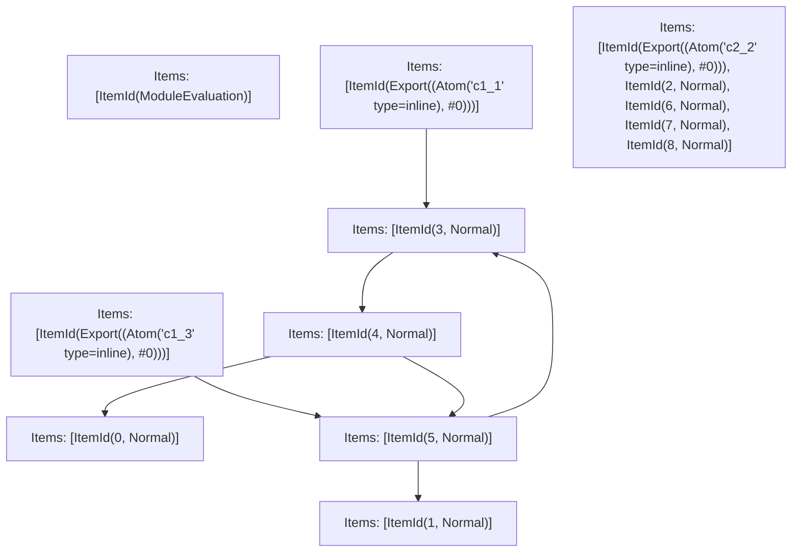

# Items

Count: 13

## Item 1: Stmt 0, `Normal`

```js
function d1() {}

```

- Hoisted
- Declares: `d1`

## Item 2: Stmt 1, `Normal`

```js
function d2() {}

```

- Hoisted
- Declares: `d2`

## Item 3: Stmt 2, `Normal`

```js
function d3() {}

```

- Hoisted
- Declares: `d3`

## Item 4: Stmt 3, `Normal`

```js
export function c1_1() {
    return c1_2();
}

```

- Hoisted
- Declares: `c1_1`
- Reads (eventual): `c1_2`

## Item 5: Stmt 4, `Normal`

```js
function c1_2() {
    return c1_3(d1);
}

```

- Hoisted
- Declares: `c1_2`
- Reads (eventual): `c1_3`, `d1`

## Item 6: Stmt 5, `Normal`

```js
export function c1_3() {
    return c1_1(d2);
}

```

- Hoisted
- Declares: `c1_3`
- Reads (eventual): `c1_1`, `d2`

## Item 7: Stmt 6, `Normal`

```js
function c2_1() {
    return c2_2(d3);
}

```

- Hoisted
- Declares: `c2_1`
- Reads (eventual): `c2_2`, `d3`

## Item 8: Stmt 7, `Normal`

```js
export function c2_2() {
    return c2_3();
}

```

- Hoisted
- Declares: `c2_2`
- Reads (eventual): `c2_3`

## Item 9: Stmt 8, `Normal`

```js
function c2_3() {
    return c2_1();
}

```

- Hoisted
- Declares: `c2_3`
- Reads (eventual): `c2_1`

# Phase 1

# Phase 2

# Phase 3

# Phase 4

# Final

# Modules (dev)
## Part 0
```js
"module evaluation";

```
## Part 1
```js
import { c1_1 } from "entry.js" assert {
    __turbopack_chunk__: 6
};
export { c1_1 };

```
## Part 2
```js
import { c1_3 } from "entry.js" assert {
    __turbopack_chunk__: 8
};
export { c1_3 };

```
## Part 3
```js
export { c2_2 };
function d3() {}
function c2_1() {
    return c2_2(d3);
}
function c2_2() {
    return c2_3();
}
function c2_3() {
    return c2_1();
}

```
## Part 4
```js
function d1() {}

```
## Part 5
```js
function d2() {}

```
## Part 6
```js
import { c1_2 } from "entry.js" assert {
    __turbopack_chunk__: 7
};
function c1_1() {
    return c1_2();
}

```
## Part 7
```js
import { c1_3 } from "entry.js" assert {
    __turbopack_chunk__: 8
};
import { d1 } from "entry.js" assert {
    __turbopack_chunk__: 4
};
function c1_2() {
    return c1_3(d1);
}

```
## Part 8
```js
import { c1_1 } from "entry.js" assert {
    __turbopack_chunk__: 6
};
import { d2 } from "entry.js" assert {
    __turbopack_chunk__: 5
};
function c1_3() {
    return c1_1(d2);
}

```
## Merged (module eval)
```js
"module evaluation";

```
# Modules (prod)
## Part 0
```js
"module evaluation";

```
## Part 1
```js
import { c1_1 } from "entry.js" assert {
    __turbopack_chunk__: 6
};
export { c1_1 };

```
## Part 2
```js
import { c1_3 } from "entry.js" assert {
    __turbopack_chunk__: 8
};
export { c1_3 };

```
## Part 3
```js
export { c2_2 };
function d3() {}
function c2_1() {
    return c2_2(d3);
}
function c2_2() {
    return c2_3();
}
function c2_3() {
    return c2_1();
}

```
## Part 4
```js
function d1() {}

```
## Part 5
```js
function d2() {}

```
## Part 6
```js
import { c1_2 } from "entry.js" assert {
    __turbopack_chunk__: 7
};
function c1_1() {
    return c1_2();
}

```
## Part 7
```js
import { c1_3 } from "entry.js" assert {
    __turbopack_chunk__: 8
};
import { d1 } from "entry.js" assert {
    __turbopack_chunk__: 4
};
function c1_2() {
    return c1_3(d1);
}

```
## Part 8
```js
import { c1_1 } from "entry.js" assert {
    __turbopack_chunk__: 6
};
import { d2 } from "entry.js" assert {
    __turbopack_chunk__: 5
};
function c1_3() {
    return c1_1(d2);
}

```
## Merged (module eval)
```js
"module evaluation";

```
