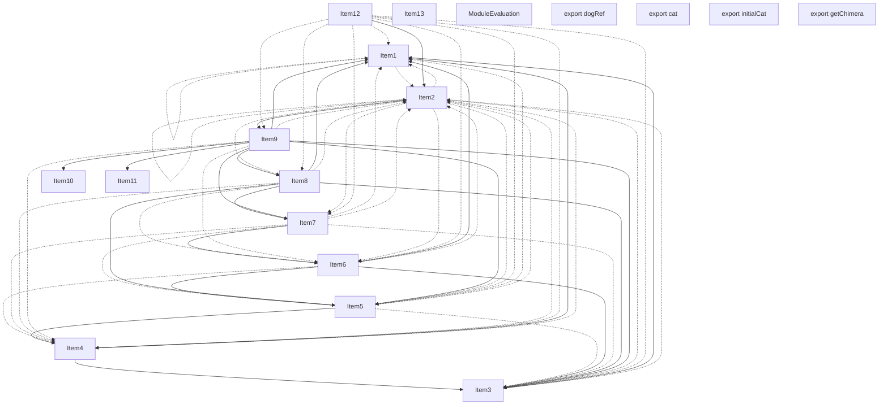
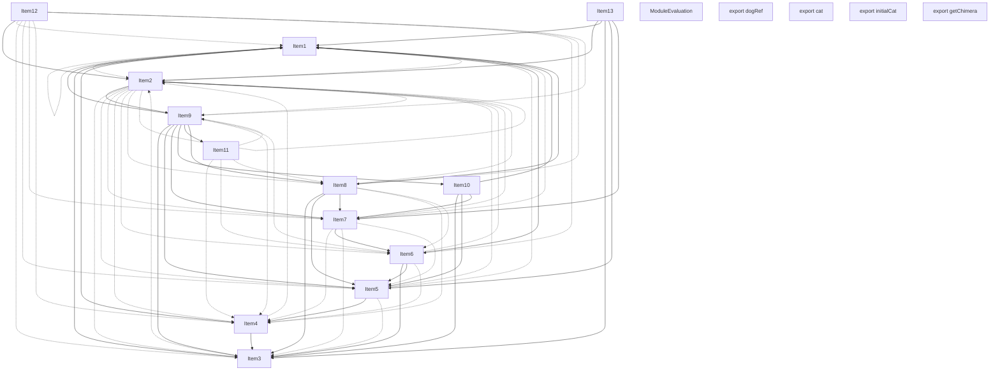
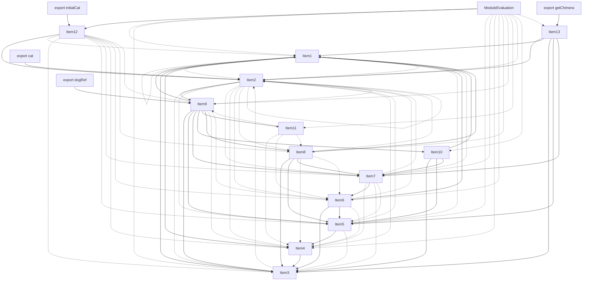

# Items

Count: 18

## Item 1: Stmt 0, `VarDeclarator(0)`

```js
let dog = "dog";
```

- Side effects
- Declares: "`dog`"
- Write: "`dog`"

## Item 2: Stmt 1, `Normal`

```js
dog += "!";
```

- Side effects
- Write: "`dog`"

## Item 3: Stmt 2, `Normal`

```js
console.log(dog);
```

- Side effects
- Reads: "`console`, `dog`"

## Item 4: Stmt 3, `Normal`

```js
function getDog() {
  return dog;
}
```

- Hoisted
- Declares: "`getDog`"
- Reads (eventual): "`dog`"

## Item 5: Stmt 4, `Normal`

```js
dog += "!";
```

- Side effects
- Write: "`dog`"

## Item 6: Stmt 5, `Normal`

```js
console.log(dog);
```

- Side effects
- Reads: "`console`, `dog`"

## Item 7: Stmt 6, `Normal`

```js
function setDog(newDog) {
  dog = newDog;
}
```

- Hoisted
- Declares: "`setDog`"
- Reads (eventual): "`newDog`"
- Write (eventual): "`newDog`, `dog`"

## Item 8: Stmt 7, `Normal`

```js
dog += "!";
```

- Side effects
- Write: "`dog`"

## Item 9: Stmt 8, `Normal`

```js
console.log(dog);
```

- Side effects
- Reads: "`console`, `dog`"

## Item 10: Stmt 9, `VarDeclarator(0)`

```js
export const dogRef = {
  initial: dog,
  get: getDog,
  set: setDog,
};
```

- Side effects
- Declares: "`dogRef`"
- Reads: "`dog`, `getDog`, `setDog`"
- Write: "`dogRef`"

## Item 11: Stmt 10, `VarDeclarator(0)`

```js
export let cat = "cat";
```

- Side effects
- Declares: "`cat`"
- Write: "`cat`"

## Item 12: Stmt 11, `VarDeclarator(0)`

```js
export const initialCat = cat;
```

- Side effects
- Declares: "`initialCat`"
- Reads: "`cat`"
- Write: "`initialCat`"

## Item 13: Stmt 12, `Normal`

```js
export function getChimera() {
  return cat + dog;
}
```

- Hoisted
- Declares: "`getChimera`"
- Reads (eventual): "`cat`, `dog`"

# Phase 1


# Phase 2



# Phase 3



# Phase 4


