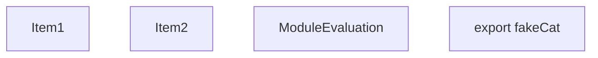
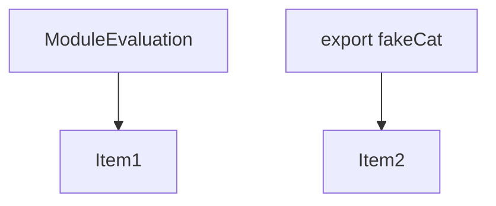
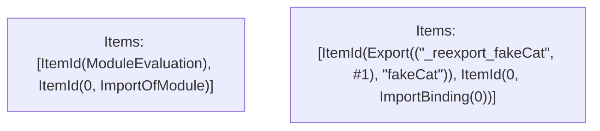

# Items

Count: 4

## Item 1: Stmt 0, `ImportOfModule`

```js
export { cat as fakeCat } from "./lib";

```

- Hoisted
- Side effects

## Item 2: Stmt 0, `ImportBinding(0)`

```js
export { cat as fakeCat } from "./lib";

```

- Hoisted
- Declares: `_reexport_fakeCat`

# Phase 1

# Phase 2

# Phase 3

# Phase 4

# Final

# Modules (dev)
## Part 0
```js
"module evaluation";
import "./lib";

```
## Part 1
```js
export { _reexport_fakeCat as fakeCat };
import { cat as _reexport_fakeCat } from "./lib";

```
## Merged (module eval)
```js
import "./lib";
"module evaluation";

```
# Modules (prod)
## Part 0
```js
"module evaluation";
import "./lib";

```
## Part 1
```js
export { _reexport_fakeCat as fakeCat };
import { cat as _reexport_fakeCat } from "./lib";

```
## Merged (module eval)
```js
import "./lib";
"module evaluation";

```
