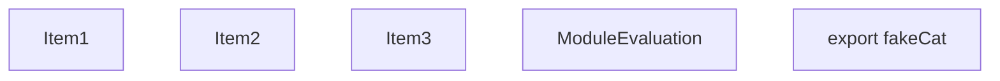
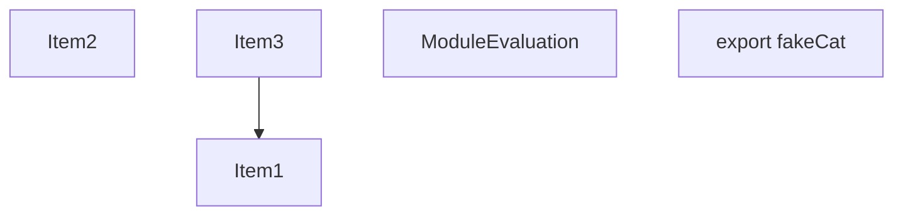
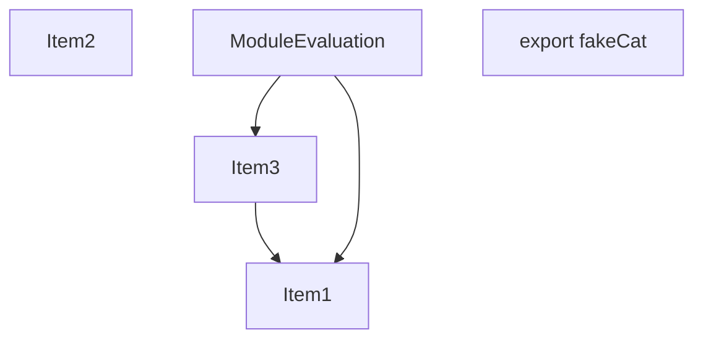

# Items

Count: 5

## Item 1: Stmt 0, `ImportOfModule`

```js
export { cat as fakeCat } from "./lib";

```

- Hoisted
- Side effects

## Item 2: Stmt 0, `ImportBinding(0)`

```js
export { cat as fakeCat } from "./lib";

```

- Hoisted
- Declares: `_reexport_fakeCat`

## Item 3: Stmt 1, `Normal`

```js
console.log("done");

```

- Side effects
- Reads: `console`

# Phase 1

# Phase 2

# Phase 3

# Phase 4

# Final
```mermaid
graph TD
    N0["Items: [ItemId(ModuleEvaluation), ItemId(0, ImportOfModule), ItemId(1, Normal)]"];
    N1["Items: [ItemId(Export((\"fakeCat\", #0)))]"];
```
# Modules (dev)
## Part 0
```js
"module evaluation";
import "./lib";
console.log("done");

```
## Part 1
```js
export { _reexport_fakeCat as fakeCat };

```
## Merged (module eval)
```js
import "./lib";
"module evaluation";
console.log("done");

```
# Modules (prod)
## Part 0
```js
"module evaluation";
import "./lib";
console.log("done");

```
## Part 1
```js
export { _reexport_fakeCat as fakeCat };

```
## Merged (module eval)
```js
import "./lib";
"module evaluation";
console.log("done");

```
