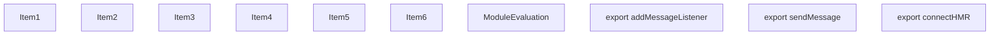
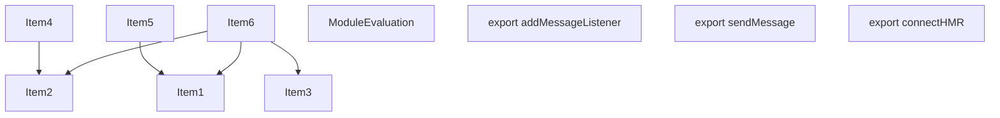
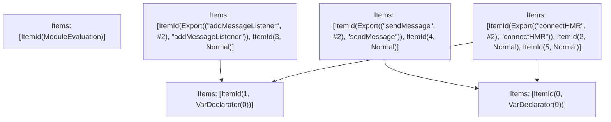

# Items

Count: 10

## Item 1: Stmt 0, `VarDeclarator(0)`

```js
let source;

```

- Declares: `source`
- Write: `source`

## Item 2: Stmt 1, `VarDeclarator(0)`

```js
const eventCallbacks = [];

```

- Declares: `eventCallbacks`
- Write: `eventCallbacks`

## Item 3: Stmt 2, `Normal`

```js
function getSocketProtocol(assetPrefix) {
    let protocol = location.protocol;
    try {
        protocol = new URL(assetPrefix).protocol;
    } catch (_) {}
    return protocol === "http:" ? "ws" : "wss";
}

```

- Hoisted
- Declares: `getSocketProtocol`

## Item 4: Stmt 3, `Normal`

```js
export function addMessageListener(cb) {
    eventCallbacks.push(cb);
}

```

- Hoisted
- Declares: `addMessageListener`
- Reads (eventual): `eventCallbacks`

## Item 5: Stmt 4, `Normal`

```js
export function sendMessage(data) {
    if (!source || source.readyState !== source.OPEN) return;
    return source.send(data);
}

```

- Hoisted
- Declares: `sendMessage`
- Reads (eventual): `source`

## Item 6: Stmt 5, `Normal`

```js
export function connectHMR(options) {
    const { timeout = 5 * 1000 } = options;
    function init() {
        if (source) source.close();
        console.log("[HMR] connecting...");
        function handleOnline() {
            const connected = {
                type: "turbopack-connected"
            };
            eventCallbacks.forEach((cb)=>{
                cb(connected);
            });
            if (options.log) console.log("[HMR] connected");
        }
        function handleMessage(event) {
            const message = {
                type: "turbopack-message",
                data: JSON.parse(event.data)
            };
            eventCallbacks.forEach((cb)=>{
                cb(message);
            });
        }
        function handleDisconnect() {
            source.close();
            setTimeout(init, timeout);
        }
        const { hostname, port } = location;
        const protocol = getSocketProtocol(options.assetPrefix || "");
        const assetPrefix = options.assetPrefix.replace(/^\/+/, "");
        let url = `${protocol}://${hostname}:${port}${assetPrefix ? `/${assetPrefix}` : ""}`;
        if (assetPrefix.startsWith("http")) {
            url = `${protocol}://${assetPrefix.split("://")[1]}`;
        }
        source = new window.WebSocket(`${url}${options.path}`);
        source.onopen = handleOnline;
        source.onerror = handleDisconnect;
        source.onmessage = handleMessage;
    }
    init();
}

```

- Hoisted
- Declares: `connectHMR`
- Reads (eventual): `source`, `eventCallbacks`, `getSocketProtocol`
- Write (eventual): `source`

# Phase 1

# Phase 2

# Phase 3

# Phase 4

# Final

# Entrypoints

```
{
    ModuleEvaluation: 0,
    Export(
        "connectHMR",
    ): 3,
    Export(
        "addMessageListener",
    ): 1,
    Export(
        "sendMessage",
    ): 2,
}
```


# Modules (dev)
## Part 0
```js
"module evaluation";

```
## Part 1
```js
import { eventCallbacks } from "entry.js" assert {
    __turbopack_part__: 5
};
export { addMessageListener };
function addMessageListener(cb) {
    eventCallbacks.push(cb);
}

```
## Part 2
```js
import { source } from "entry.js" assert {
    __turbopack_part__: 4
};
export { sendMessage };
function sendMessage(data) {
    if (!source || source.readyState !== source.OPEN) return;
    return source.send(data);
}

```
## Part 3
```js
import { source } from "entry.js" assert {
    __turbopack_part__: 4
};
import { eventCallbacks } from "entry.js" assert {
    __turbopack_part__: 5
};
export { connectHMR };
function getSocketProtocol(assetPrefix) {
    let protocol = location.protocol;
    try {
        protocol = new URL(assetPrefix).protocol;
    } catch (_) {}
    return protocol === "http:" ? "ws" : "wss";
}
function connectHMR(options) {
    const { timeout = 5 * 1000 } = options;
    function init() {
        if (source) source.close();
        console.log("[HMR] connecting...");
        function handleOnline() {
            const connected = {
                type: "turbopack-connected"
            };
            eventCallbacks.forEach((cb)=>{
                cb(connected);
            });
            if (options.log) console.log("[HMR] connected");
        }
        function handleMessage(event) {
            const message = {
                type: "turbopack-message",
                data: JSON.parse(event.data)
            };
            eventCallbacks.forEach((cb)=>{
                cb(message);
            });
        }
        function handleDisconnect() {
            source.close();
            setTimeout(init, timeout);
        }
        const { hostname, port } = location;
        const protocol = getSocketProtocol(options.assetPrefix || "");
        const assetPrefix = options.assetPrefix.replace(/^\/+/, "");
        let url = `${protocol}://${hostname}:${port}${assetPrefix ? `/${assetPrefix}` : ""}`;
        if (assetPrefix.startsWith("http")) {
            url = `${protocol}://${assetPrefix.split("://")[1]}`;
        }
        source = new window.WebSocket(`${url}${options.path}`);
        source.onopen = handleOnline;
        source.onerror = handleDisconnect;
        source.onmessage = handleMessage;
    }
    init();
}

```
## Part 4
```js
let source;
export { source };

```
## Part 5
```js
const eventCallbacks = [];
export { eventCallbacks };

```
## Merged (module eval)
```js
"module evaluation";

```
# Entrypoints

```
{
    ModuleEvaluation: 0,
    Export(
        "connectHMR",
    ): 3,
    Export(
        "addMessageListener",
    ): 1,
    Export(
        "sendMessage",
    ): 2,
}
```


# Modules (prod)
## Part 0
```js
"module evaluation";

```
## Part 1
```js
import { eventCallbacks } from "entry.js" assert {
    __turbopack_part__: 5
};
export { addMessageListener };
function addMessageListener(cb) {
    eventCallbacks.push(cb);
}

```
## Part 2
```js
import { source } from "entry.js" assert {
    __turbopack_part__: 4
};
export { sendMessage };
function sendMessage(data) {
    if (!source || source.readyState !== source.OPEN) return;
    return source.send(data);
}

```
## Part 3
```js
import { source } from "entry.js" assert {
    __turbopack_part__: 4
};
import { eventCallbacks } from "entry.js" assert {
    __turbopack_part__: 5
};
export { connectHMR };
function getSocketProtocol(assetPrefix) {
    let protocol = location.protocol;
    try {
        protocol = new URL(assetPrefix).protocol;
    } catch (_) {}
    return protocol === "http:" ? "ws" : "wss";
}
function connectHMR(options) {
    const { timeout = 5 * 1000 } = options;
    function init() {
        if (source) source.close();
        console.log("[HMR] connecting...");
        function handleOnline() {
            const connected = {
                type: "turbopack-connected"
            };
            eventCallbacks.forEach((cb)=>{
                cb(connected);
            });
            if (options.log) console.log("[HMR] connected");
        }
        function handleMessage(event) {
            const message = {
                type: "turbopack-message",
                data: JSON.parse(event.data)
            };
            eventCallbacks.forEach((cb)=>{
                cb(message);
            });
        }
        function handleDisconnect() {
            source.close();
            setTimeout(init, timeout);
        }
        const { hostname, port } = location;
        const protocol = getSocketProtocol(options.assetPrefix || "");
        const assetPrefix = options.assetPrefix.replace(/^\/+/, "");
        let url = `${protocol}://${hostname}:${port}${assetPrefix ? `/${assetPrefix}` : ""}`;
        if (assetPrefix.startsWith("http")) {
            url = `${protocol}://${assetPrefix.split("://")[1]}`;
        }
        source = new window.WebSocket(`${url}${options.path}`);
        source.onopen = handleOnline;
        source.onerror = handleDisconnect;
        source.onmessage = handleMessage;
    }
    init();
}

```
## Part 4
```js
let source;
export { source };

```
## Part 5
```js
const eventCallbacks = [];
export { eventCallbacks };

```
## Merged (module eval)
```js
"module evaluation";

```
