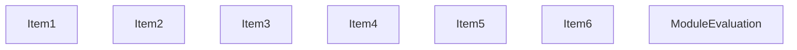
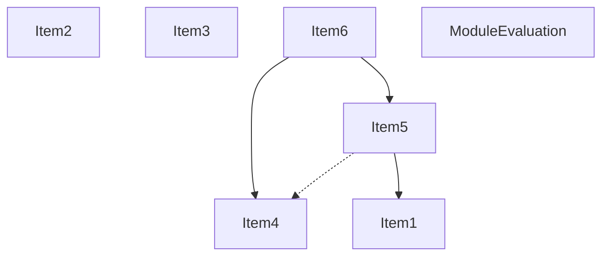
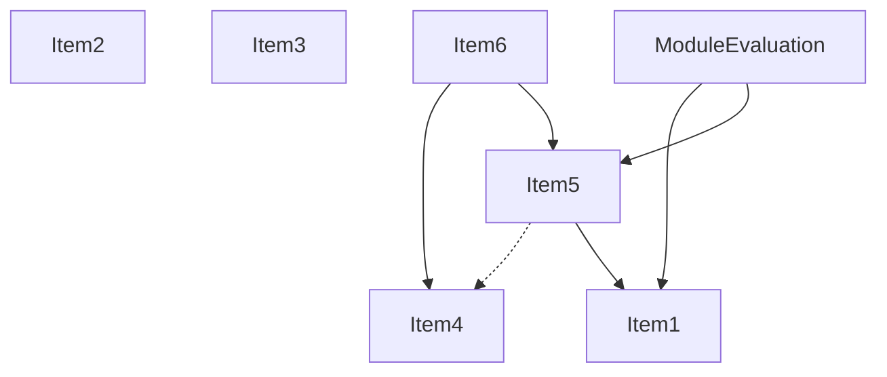
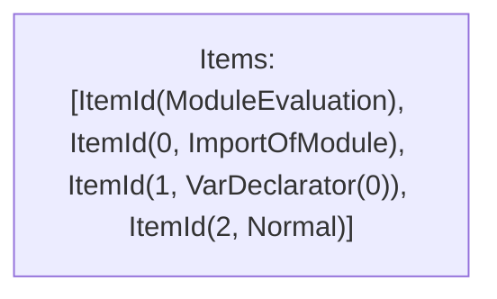

# Items

Count: 7

## Item 1: Stmt 0, `ImportOfModule`

```js
import { LogSpanAllowList, NextVanillaSpanAllowlist } from './constants';

```

- Hoisted
- Side effects

## Item 2: Stmt 0, `ImportBinding(0)`

```js
import { LogSpanAllowList, NextVanillaSpanAllowlist } from './constants';

```

- Hoisted
- Declares: `LogSpanAllowList`

## Item 3: Stmt 0, `ImportBinding(1)`

```js
import { LogSpanAllowList, NextVanillaSpanAllowlist } from './constants';

```

- Hoisted
- Declares: `NextVanillaSpanAllowlist`

## Item 4: Stmt 1, `VarDeclarator(0)`

```js
let api;

```

- Declares: `api`
- Write: `api`

## Item 5: Stmt 2, `Normal`

```js
if (process.env.NEXT_RUNTIME === 'edge') {
    api = require('@opentelemetry/api');
} else {
    try {
        api = require('@opentelemetry/api');
    } catch (err) {
        api = require('next/dist/compiled/@opentelemetry/api');
    }
}

```

- Side effects
- Write: `api`

## Item 6: Stmt 3, `VarDeclarator(0)`

```js
const { context, propagation, trace, SpanStatusCode, SpanKind, ROOT_CONTEXT } = api;

```

- Declares: `context`, `propagation`, `trace`, `SpanStatusCode`, `SpanKind`, `ROOT_CONTEXT`
- Reads: `api`
- Write: `context`, `propagation`, `trace`, `SpanStatusCode`, `SpanKind`, `ROOT_CONTEXT`

# Phase 1

# Phase 2

# Phase 3

# Phase 4

# Final

# Entrypoints

```
{
    ModuleEvaluation: 0,
}
```


# Modules (dev)
## Part 0
```js
"module evaluation";
import './constants';
let api;
if (process.env.NEXT_RUNTIME === 'edge') {
    api = require('@opentelemetry/api');
} else {
    try {
        api = require('@opentelemetry/api');
    } catch (err) {
        api = require('next/dist/compiled/@opentelemetry/api');
    }
}
export { api } from "__TURBOPACK_VAR__" assert {
    __turbopack_var__: true
};

```
## Merged (module eval)
```js
import './constants';
"module evaluation";
let api;
if (process.env.NEXT_RUNTIME === 'edge') {
    api = require('@opentelemetry/api');
} else {
    try {
        api = require('@opentelemetry/api');
    } catch (err) {
        api = require('next/dist/compiled/@opentelemetry/api');
    }
}
export { api } from "__TURBOPACK_VAR__" assert {
    __turbopack_var__: true
};

```
# Entrypoints

```
{
    ModuleEvaluation: 0,
}
```


# Modules (prod)
## Part 0
```js
"module evaluation";
import './constants';
if (process.env.NEXT_RUNTIME === 'edge') {
    api = require('@opentelemetry/api');
} else {
    try {
        api = require('@opentelemetry/api');
    } catch (err) {
        api = require('next/dist/compiled/@opentelemetry/api');
    }
}

```
## Merged (module eval)
```js
import './constants';
"module evaluation";
if (process.env.NEXT_RUNTIME === 'edge') {
    api = require('@opentelemetry/api');
} else {
    try {
        api = require('@opentelemetry/api');
    } catch (err) {
        api = require('next/dist/compiled/@opentelemetry/api');
    }
}

```
