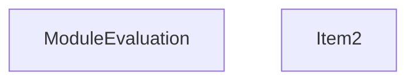
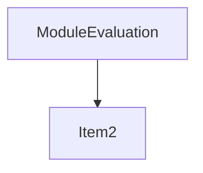
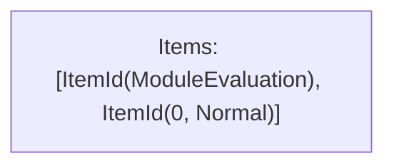

# Items

Count: 2

## Item 2: Stmt 0, `Normal`

```js
process.turbopack = {};

```

- Side effects

# Phase 1

# Phase 2

# Phase 3

# Phase 4

# Final

# Entrypoints

```
{
    ModuleEvaluation: 0,
}
```


# Modules (dev)
## Part 0
```js
"module evaluation";
process.turbopack = {};

```
## Merged (module eval)
```js
"module evaluation";
process.turbopack = {};

```
# Entrypoints

```
{
    ModuleEvaluation: 0,
}
```


# Modules (prod)
## Part 0
```js
"module evaluation";
process.turbopack = {};

```
## Merged (module eval)
```js
"module evaluation";
process.turbopack = {};

```
