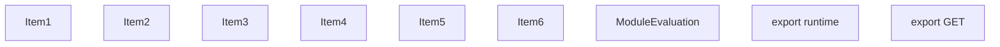
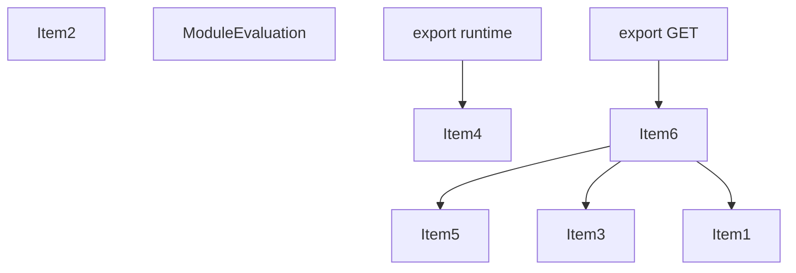
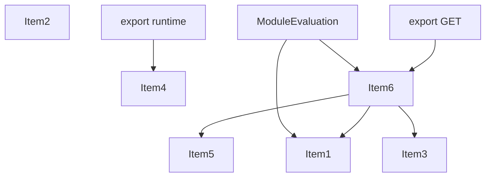
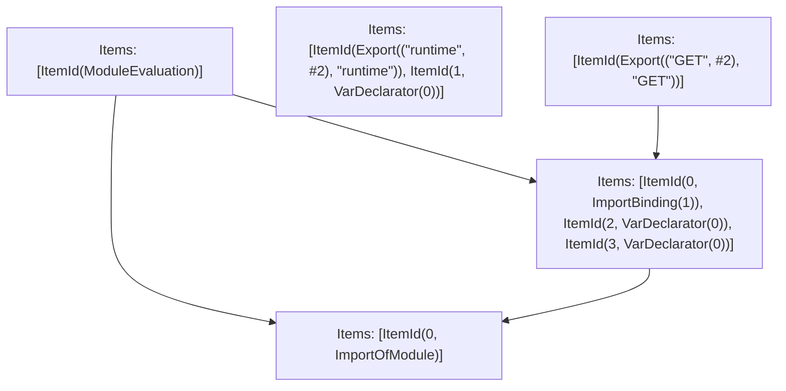

# Items

Count: 9

## Item 1: Stmt 0, `ImportOfModule`

```js
import { NextRequest, NextResponse } from 'next/server';

```

- Hoisted
- Side effects

## Item 2: Stmt 0, `ImportBinding(0)`

```js
import { NextRequest, NextResponse } from 'next/server';

```

- Hoisted
- Declares: `NextRequest`

## Item 3: Stmt 0, `ImportBinding(1)`

```js
import { NextRequest, NextResponse } from 'next/server';

```

- Hoisted
- Declares: `NextResponse`

## Item 4: Stmt 1, `VarDeclarator(0)`

```js
export const runtime = 'edge';

```

- Declares: `runtime`
- Write: `runtime`

## Item 5: Stmt 2, `VarDeclarator(0)`

```js
let count = 0;

```

- Declares: `count`
- Write: `count`

## Item 6: Stmt 3, `VarDeclarator(0)`

```js
export const GET = async (req)=>{
    await fetch(req.nextUrl);
    count++;
    return NextResponse.json({
        count
    });
};

```

- Side effects
- Declares: `GET`
- Reads: `count`, `NextResponse`
- Write: `GET`, `NextResponse`

# Phase 1

# Phase 2

# Phase 3

# Phase 4

# Final

# Entrypoints

```
{
    ModuleEvaluation: 0,
    Export(
        "GET",
    ): 2,
    Export(
        "runtime",
    ): 1,
}
```


# Modules (dev)
## Part 0
```js
import "__TURBOPACK_PART__" assert {
    __turbopack_part__: 3
};
import "__TURBOPACK_PART__" assert {
    __turbopack_part__: 4
};
"module evaluation";

```
## Part 1
```js
export { runtime };
const runtime = 'edge';
export { runtime } from "__TURBOPACK_VAR__" assert {
    __turbopack_var__: true
};

```
## Part 2
```js
import { GET } from "__TURBOPACK_PART__" assert {
    __turbopack_part__: 4
};
export { GET };

```
## Part 3
```js
import 'next/server';

```
## Part 4
```js
import "__TURBOPACK_PART__" assert {
    __turbopack_part__: 3
};
import { NextResponse } from 'next/server';
let count = 0;
const GET = async (req)=>{
    await fetch(req.nextUrl);
    count++;
    return NextResponse.json({
        count
    });
};
export { NextResponse } from "__TURBOPACK_VAR__" assert {
    __turbopack_var__: true
};
export { count } from "__TURBOPACK_VAR__" assert {
    __turbopack_var__: true
};
export { GET } from "__TURBOPACK_VAR__" assert {
    __turbopack_var__: true
};

```
## Merged (module eval)
```js
import "__TURBOPACK_PART__" assert {
    __turbopack_part__: 3
};
import "__TURBOPACK_PART__" assert {
    __turbopack_part__: 4
};
"module evaluation";

```
# Entrypoints

```
{
    ModuleEvaluation: 0,
    Export(
        "GET",
    ): 2,
    Export(
        "runtime",
    ): 1,
}
```


# Modules (prod)
## Part 0
```js
import "__TURBOPACK_PART__" assert {
    __turbopack_part__: 3
};
import "__TURBOPACK_PART__" assert {
    __turbopack_part__: 4
};
"module evaluation";

```
## Part 1
```js
export { runtime };
const runtime = 'edge';
export { runtime } from "__TURBOPACK_VAR__" assert {
    __turbopack_var__: true
};

```
## Part 2
```js
import { GET } from "__TURBOPACK_PART__" assert {
    __turbopack_part__: 4
};
export { GET };

```
## Part 3
```js
import 'next/server';

```
## Part 4
```js
import "__TURBOPACK_PART__" assert {
    __turbopack_part__: 3
};
import { NextResponse } from 'next/server';
let count = 0;
const GET = async (req)=>{
    await fetch(req.nextUrl);
    count++;
    return NextResponse.json({
        count
    });
};
export { NextResponse } from "__TURBOPACK_VAR__" assert {
    __turbopack_var__: true
};
export { count } from "__TURBOPACK_VAR__" assert {
    __turbopack_var__: true
};
export { GET } from "__TURBOPACK_VAR__" assert {
    __turbopack_var__: true
};

```
## Merged (module eval)
```js
import "__TURBOPACK_PART__" assert {
    __turbopack_part__: 3
};
import "__TURBOPACK_PART__" assert {
    __turbopack_part__: 4
};
"module evaluation";

```
