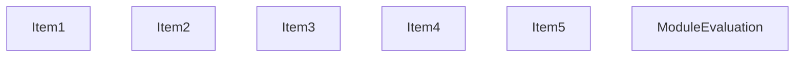
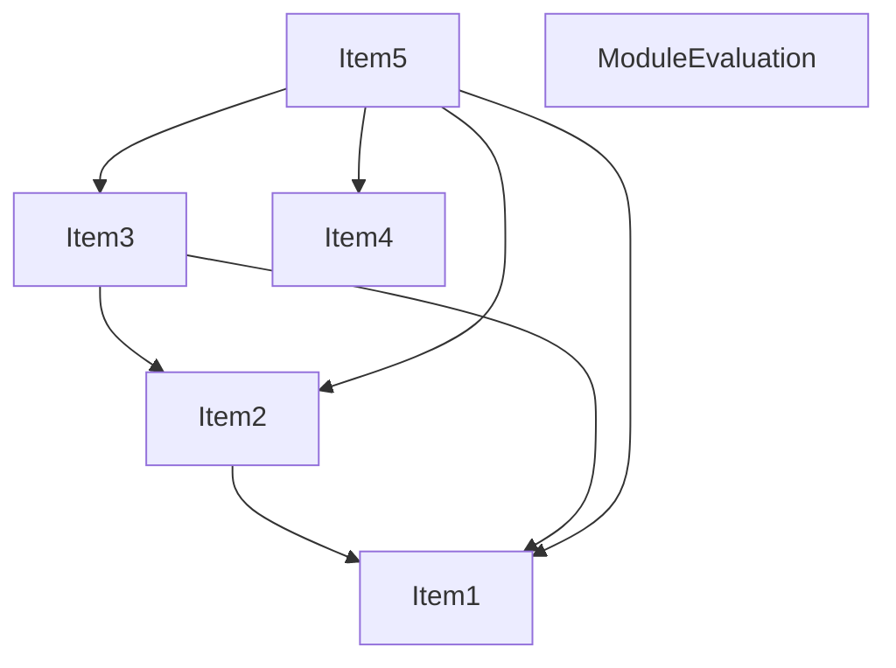
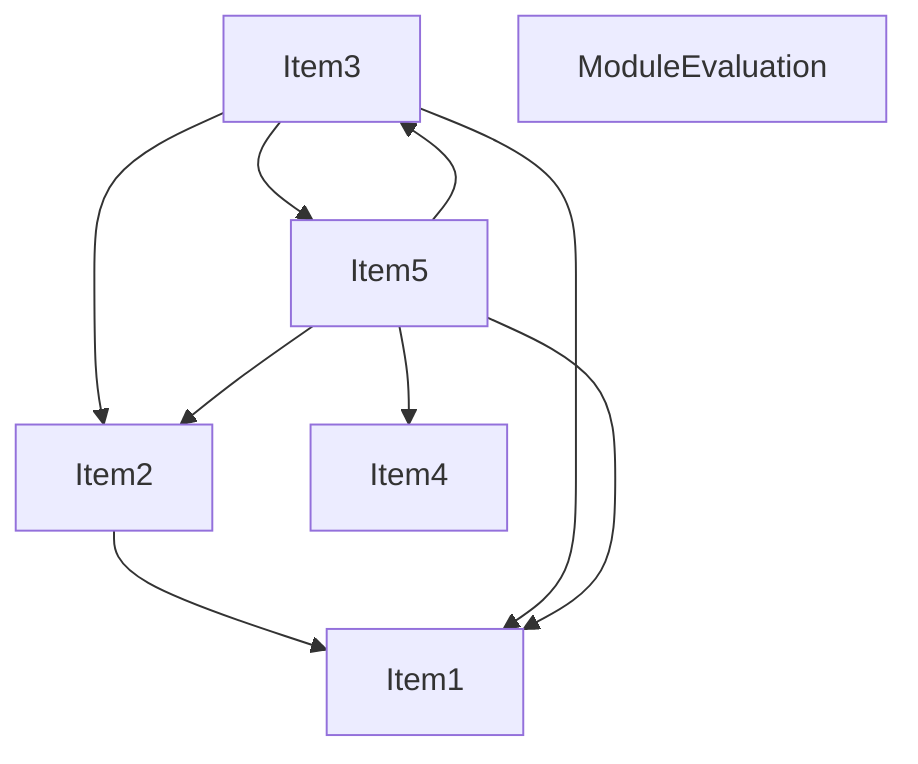
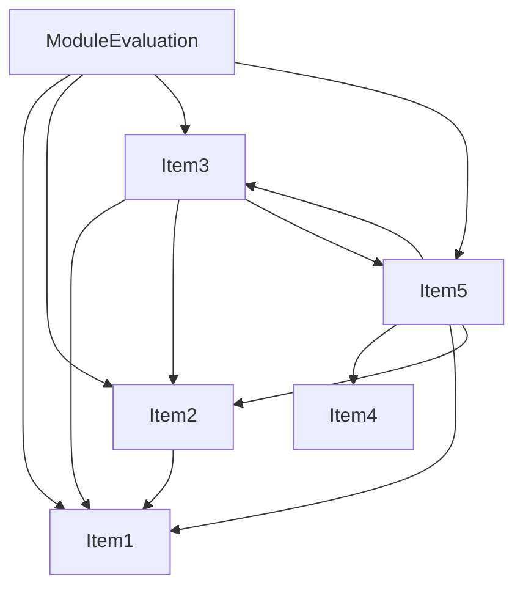
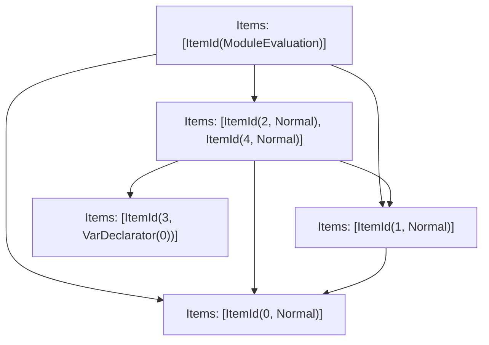

# Items

Count: 6

## Item 1: Stmt 0, `Normal`

```js
"use strict";

```

- Side effects

## Item 2: Stmt 1, `Normal`

```js
Object.defineProperty(exports, "__esModule", {
    value: true
});

```

- Side effects
- Reads: `Object`, `exports`

## Item 3: Stmt 2, `Normal`

```js
Object.defineProperty(exports, "RouteKind", {
    enumerable: true,
    get: function() {
        return RouteKind;
    }
});

```

- Side effects
- Reads: `Object`, `exports`
- Reads (eventual): `RouteKind`

## Item 4: Stmt 3, `VarDeclarator(0)`

```js
var RouteKind;

```

- Declares: `RouteKind`
- Write: `RouteKind`

## Item 5: Stmt 4, `Normal`

```js
(function(RouteKind) {
    RouteKind["PAGES"] = "PAGES";
    RouteKind["PAGES_API"] = "PAGES_API";
    RouteKind["APP_PAGE"] = "APP_PAGE";
    RouteKind["APP_ROUTE"] = "APP_ROUTE";
})(RouteKind || (RouteKind = {}));

```

- Side effects
- Reads: `RouteKind`
- Write: `RouteKind`

# Phase 1

# Phase 2

# Phase 3

# Phase 4

# Final

# Entrypoints

```
{
    ModuleEvaluation: 0,
}
```


# Modules (dev)
## Part 0
```js
import "__TURBOPACK_PART__" assert {
    __turbopack_part__: 2
};
import "__TURBOPACK_PART__" assert {
    __turbopack_part__: 3
};
import "__TURBOPACK_PART__" assert {
    __turbopack_part__: 1
};
"module evaluation";

```
## Part 1
```js
import "__TURBOPACK_PART__" assert {
    __turbopack_part__: 2
};
import "__TURBOPACK_PART__" assert {
    __turbopack_part__: 3
};
import { RouteKind } from "__TURBOPACK_PART__" assert {
    __turbopack_part__: 4
};
Object.defineProperty(exports, "RouteKind", {
    enumerable: true,
    get: function() {
        return RouteKind;
    }
});
(function(RouteKind) {
    RouteKind["PAGES"] = "PAGES";
    RouteKind["PAGES_API"] = "PAGES_API";
    RouteKind["APP_PAGE"] = "APP_PAGE";
    RouteKind["APP_ROUTE"] = "APP_ROUTE";
})(RouteKind || (RouteKind = {}));

```
## Part 2
```js
"use strict";

```
## Part 3
```js
import "__TURBOPACK_PART__" assert {
    __turbopack_part__: 2
};
Object.defineProperty(exports, "__esModule", {
    value: true
});

```
## Part 4
```js
var RouteKind;
export { RouteKind };

```
## Merged (module eval)
```js
import "__TURBOPACK_PART__" assert {
    __turbopack_part__: 2
};
import "__TURBOPACK_PART__" assert {
    __turbopack_part__: 3
};
import "__TURBOPACK_PART__" assert {
    __turbopack_part__: 1
};
"module evaluation";

```
# Entrypoints

```
{
    ModuleEvaluation: 0,
}
```


# Modules (prod)
## Part 0
```js
import "__TURBOPACK_PART__" assert {
    __turbopack_part__: 2
};
import "__TURBOPACK_PART__" assert {
    __turbopack_part__: 3
};
import "__TURBOPACK_PART__" assert {
    __turbopack_part__: 1
};
"module evaluation";

```
## Part 1
```js
import "__TURBOPACK_PART__" assert {
    __turbopack_part__: 2
};
import "__TURBOPACK_PART__" assert {
    __turbopack_part__: 3
};
import { RouteKind } from "__TURBOPACK_PART__" assert {
    __turbopack_part__: 4
};
Object.defineProperty(exports, "RouteKind", {
    enumerable: true,
    get: function() {
        return RouteKind;
    }
});
(function(RouteKind) {
    RouteKind["PAGES"] = "PAGES";
    RouteKind["PAGES_API"] = "PAGES_API";
    RouteKind["APP_PAGE"] = "APP_PAGE";
    RouteKind["APP_ROUTE"] = "APP_ROUTE";
})(RouteKind || (RouteKind = {}));

```
## Part 2
```js
"use strict";

```
## Part 3
```js
import "__TURBOPACK_PART__" assert {
    __turbopack_part__: 2
};
Object.defineProperty(exports, "__esModule", {
    value: true
});

```
## Part 4
```js
var RouteKind;
export { RouteKind };

```
## Merged (module eval)
```js
import "__TURBOPACK_PART__" assert {
    __turbopack_part__: 2
};
import "__TURBOPACK_PART__" assert {
    __turbopack_part__: 3
};
import "__TURBOPACK_PART__" assert {
    __turbopack_part__: 1
};
"module evaluation";

```
