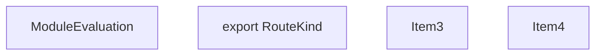
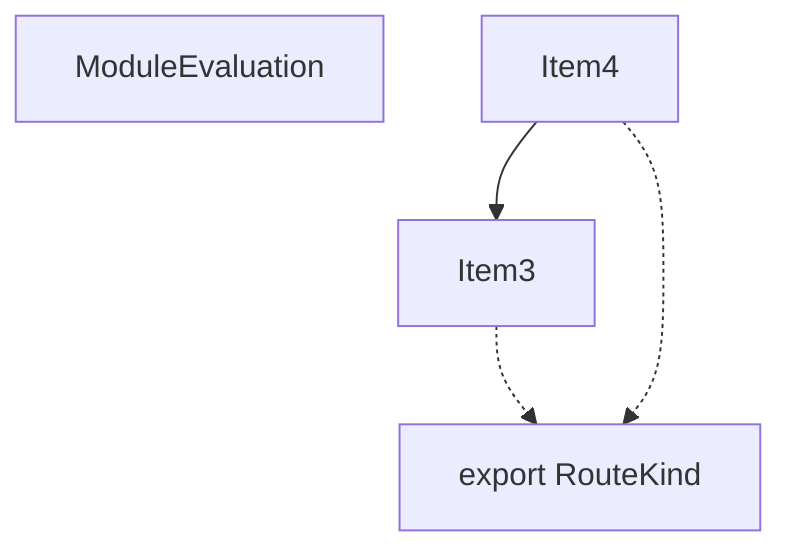
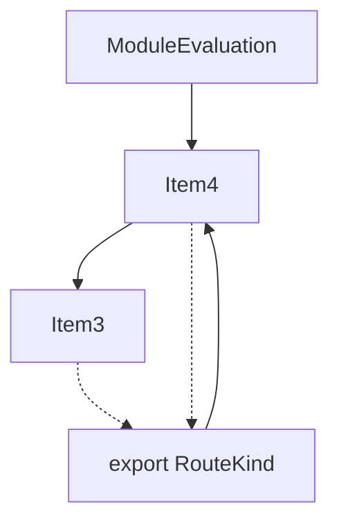
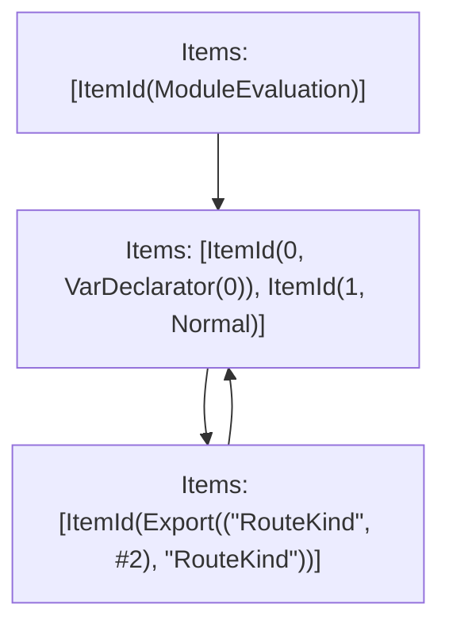

# Items

Count: 4

## Item 3: Stmt 0, `VarDeclarator(0)`

```js
export var RouteKind;

```

- Declares: `RouteKind`
- Write: `RouteKind`

## Item 4: Stmt 1, `Normal`

```js
(function(RouteKind) {
    RouteKind["PAGES"] = "PAGES";
    RouteKind["PAGES_API"] = "PAGES_API";
    RouteKind["APP_PAGE"] = "APP_PAGE";
    RouteKind["APP_ROUTE"] = "APP_ROUTE";
})(RouteKind || (RouteKind = {}));

```

- Side effects
- Reads: `RouteKind`
- Write: `RouteKind`

# Phase 1

# Phase 2

# Phase 3

# Phase 4

# Final

# Entrypoints

```
{
    ModuleEvaluation: 0,
    Export(
        "RouteKind",
    ): 1,
}
```


# Modules (dev)
## Part 0
```js
import "__TURBOPACK_PART__" assert {
    __turbopack_part__: 2
};
"module evaluation";

```
## Part 1
```js
import { RouteKind } from "__TURBOPACK_PART__" assert {
    __turbopack_part__: 2
};
export { RouteKind };

```
## Part 2
```js
import "__TURBOPACK_PART__" assert {
    __turbopack_part__: 1
};
var RouteKind;
(function(RouteKind) {
    RouteKind["PAGES"] = "PAGES";
    RouteKind["PAGES_API"] = "PAGES_API";
    RouteKind["APP_PAGE"] = "APP_PAGE";
    RouteKind["APP_ROUTE"] = "APP_ROUTE";
})(RouteKind || (RouteKind = {}));
export { RouteKind } from "__TURBOPACK_VAR__" assert {
    __turbopack_var__: true
};

```
## Merged (module eval)
```js
import "__TURBOPACK_PART__" assert {
    __turbopack_part__: 2
};
"module evaluation";

```
# Entrypoints

```
{
    ModuleEvaluation: 0,
    Export(
        "RouteKind",
    ): 1,
}
```


# Modules (prod)
## Part 0
```js
import "__TURBOPACK_PART__" assert {
    __turbopack_part__: 2
};
"module evaluation";

```
## Part 1
```js
import { RouteKind } from "__TURBOPACK_PART__" assert {
    __turbopack_part__: 2
};
export { RouteKind };

```
## Part 2
```js
var RouteKind;
(function(RouteKind) {
    RouteKind["PAGES"] = "PAGES";
    RouteKind["PAGES_API"] = "PAGES_API";
    RouteKind["APP_PAGE"] = "APP_PAGE";
    RouteKind["APP_ROUTE"] = "APP_ROUTE";
})(RouteKind || (RouteKind = {}));
export { RouteKind } from "__TURBOPACK_VAR__" assert {
    __turbopack_var__: true
};

```
## Merged (module eval)
```js
import "__TURBOPACK_PART__" assert {
    __turbopack_part__: 2
};
"module evaluation";

```
