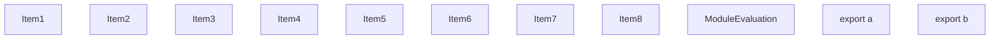
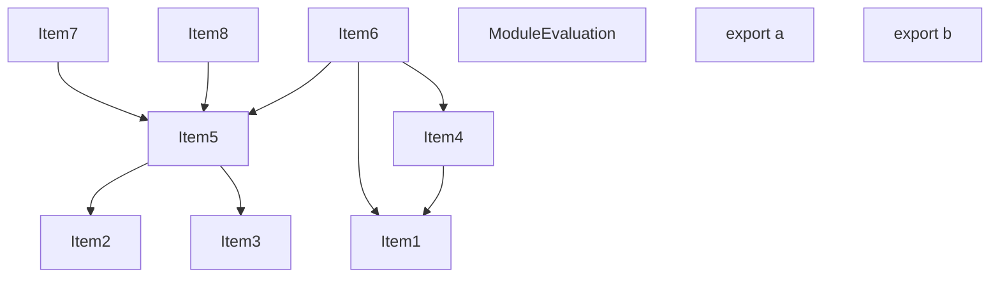
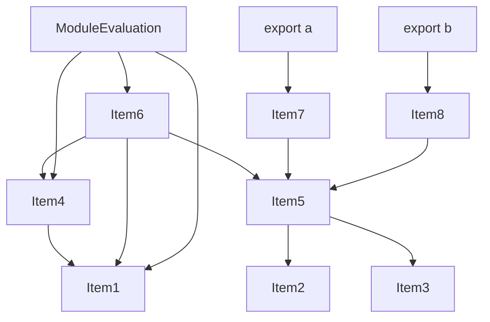
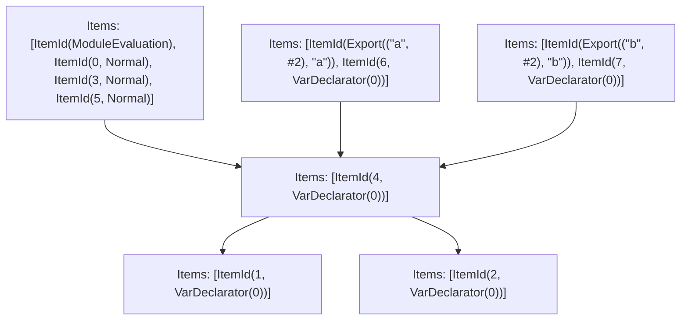

# Items

Count: 11

## Item 1: Stmt 0, `Normal`

```js
console.log("Hello");

```

- Side effects
- Reads: `console`

## Item 2: Stmt 1, `VarDeclarator(0)`

```js
const value = externalFunction();

```

- Declares: `value`
- Reads: `externalFunction`
- Write: `value`

## Item 3: Stmt 2, `VarDeclarator(0)`

```js
const value2 = externalObject.propertyWithGetter;

```

- Declares: `value2`
- Reads: `externalObject`
- Write: `value2`

## Item 4: Stmt 3, `Normal`

```js
externalObject.propertyWithSetter = 42;

```

- Side effects
- Reads: `externalObject`

## Item 5: Stmt 4, `VarDeclarator(0)`

```js
const shared = {
    value,
    value2
};

```

- Declares: `shared`
- Reads: `value`, `value2`
- Write: `shared`

## Item 6: Stmt 5, `Normal`

```js
console.log(shared);

```

- Side effects
- Reads: `console`, `shared`

## Item 7: Stmt 6, `VarDeclarator(0)`

```js
export const a = {
    shared,
    a: "aaaaaaaaaaa"
};

```

- Declares: `a`
- Reads: `shared`
- Write: `a`

## Item 8: Stmt 7, `VarDeclarator(0)`

```js
export const b = {
    shared,
    b: "bbbbbbbbbbb"
};

```

- Declares: `b`
- Reads: `shared`
- Write: `b`

# Phase 1

# Phase 2

# Phase 3

# Phase 4

# Final

# Entrypoints

```
{
    ModuleEvaluation: 0,
    Export(
        "b",
    ): 2,
    Export(
        "a",
    ): 1,
}
```


# Modules (dev)
## Part 0
```js
import { shared } from "__TURBOPACK_PART__" assert {
    __turbopack_part__: 5
};
"module evaluation";
console.log("Hello");
externalObject.propertyWithSetter = 42;
console.log(shared);

```
## Part 1
```js
import { shared } from "__TURBOPACK_PART__" assert {
    __turbopack_part__: 5
};
export { a };
const a = {
    shared,
    a: "aaaaaaaaaaa"
};
export { a } from "__TURBOPACK_VAR__" assert {
    __turbopack_var__: true
};

```
## Part 2
```js
import { shared } from "__TURBOPACK_PART__" assert {
    __turbopack_part__: 5
};
export { b };
const b = {
    shared,
    b: "bbbbbbbbbbb"
};
export { b } from "__TURBOPACK_VAR__" assert {
    __turbopack_var__: true
};

```
## Part 3
```js
const value = externalFunction();
export { value } from "__TURBOPACK_VAR__" assert {
    __turbopack_var__: true
};

```
## Part 4
```js
const value2 = externalObject.propertyWithGetter;
export { value2 } from "__TURBOPACK_VAR__" assert {
    __turbopack_var__: true
};

```
## Part 5
```js
import { value } from "__TURBOPACK_PART__" assert {
    __turbopack_part__: 3
};
import { value2 } from "__TURBOPACK_PART__" assert {
    __turbopack_part__: 4
};
const shared = {
    value,
    value2
};
export { shared } from "__TURBOPACK_VAR__" assert {
    __turbopack_var__: true
};

```
## Merged (module eval)
```js
import { shared } from "__TURBOPACK_PART__" assert {
    __turbopack_part__: 5
};
"module evaluation";
console.log("Hello");
externalObject.propertyWithSetter = 42;
console.log(shared);

```
# Entrypoints

```
{
    ModuleEvaluation: 0,
    Export(
        "b",
    ): 2,
    Export(
        "a",
    ): 1,
}
```


# Modules (prod)
## Part 0
```js
import { shared } from "__TURBOPACK_PART__" assert {
    __turbopack_part__: 5
};
"module evaluation";
console.log("Hello");
externalObject.propertyWithSetter = 42;
console.log(shared);

```
## Part 1
```js
import { shared } from "__TURBOPACK_PART__" assert {
    __turbopack_part__: 5
};
export { a };
const a = {
    shared,
    a: "aaaaaaaaaaa"
};
export { a } from "__TURBOPACK_VAR__" assert {
    __turbopack_var__: true
};

```
## Part 2
```js
import { shared } from "__TURBOPACK_PART__" assert {
    __turbopack_part__: 5
};
export { b };
const b = {
    shared,
    b: "bbbbbbbbbbb"
};
export { b } from "__TURBOPACK_VAR__" assert {
    __turbopack_var__: true
};

```
## Part 3
```js
const value = externalFunction();
export { value } from "__TURBOPACK_VAR__" assert {
    __turbopack_var__: true
};

```
## Part 4
```js
const value2 = externalObject.propertyWithGetter;
export { value2 } from "__TURBOPACK_VAR__" assert {
    __turbopack_var__: true
};

```
## Part 5
```js
import { value } from "__TURBOPACK_PART__" assert {
    __turbopack_part__: 3
};
import { value2 } from "__TURBOPACK_PART__" assert {
    __turbopack_part__: 4
};
const shared = {
    value,
    value2
};
export { shared } from "__TURBOPACK_VAR__" assert {
    __turbopack_var__: true
};

```
## Merged (module eval)
```js
import { shared } from "__TURBOPACK_PART__" assert {
    __turbopack_part__: 5
};
"module evaluation";
console.log("Hello");
externalObject.propertyWithSetter = 42;
console.log(shared);

```
