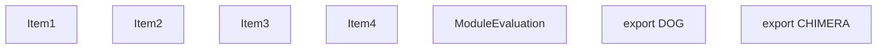
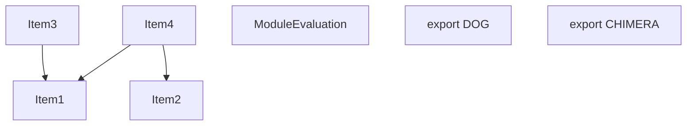
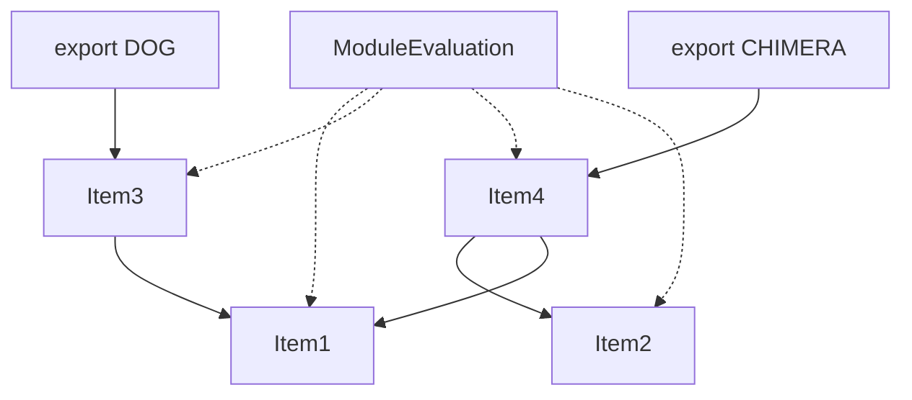
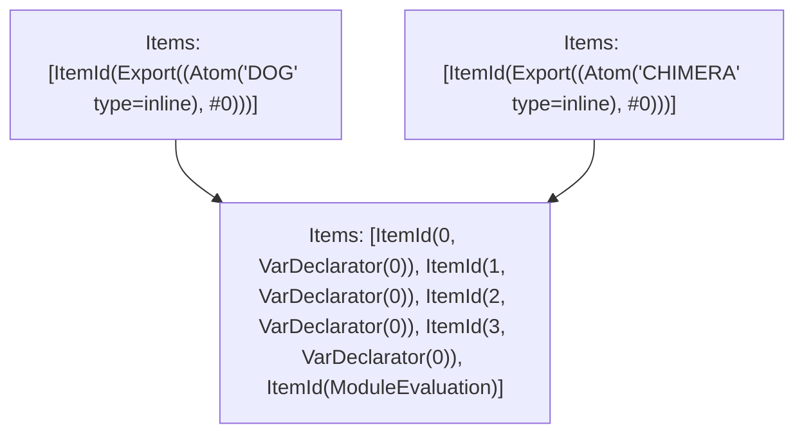

# Items

Count: 7

## Item 1: Stmt 0, `VarDeclarator(0)`

```js
const dog = "dog";
```

- Declares: "`dog`"
- Write: "`dog`"

## Item 2: Stmt 1, `VarDeclarator(0)`

```js
const cat = "cat";
```

- Declares: "`cat`"
- Write: "`cat`"

## Item 3: Stmt 2, `VarDeclarator(0)`

```js
export const DOG = dog;
```

- Declares: "`DOG`"
- Reads: "`dog`"
- Write: "`DOG`"

## Item 4: Stmt 3, `VarDeclarator(0)`

```js
export const CHIMERA = cat + dog;
```

- Declares: "`CHIMERA`"
- Reads: "`cat`, `dog`"
- Write: "`CHIMERA`"

# Phase 1



# Phase 2



# Phase 3


# Phase 4



# Final



# Modules (dev)

## Module 1

```js
"turbopack://chunk-0";
const dog = "dog";
const cat = "cat";
export const DOG = dog;
export const CHIMERA = cat + dog;
("module evaluation");
```

## Module 2

```js
"turbopack://chunk-1";
import "turbopack://chunk-0.js";
export { DOG };
```

## Module 3

```js
"turbopack://chunk-2";
import "turbopack://chunk-0.js";
export { CHIMERA };
```

# Modules (prod)

## Module 1

```js
"turbopack://chunk-0";
"module evaluation";
```

## Module 2

```js
"turbopack://chunk-1";
import "turbopack://chunk-2.js";
export const DOG = dog;
export { DOG };
```

## Module 3

```js
"turbopack://chunk-2";
const dog = "dog";
const cat = "cat";
export const CHIMERA = cat + dog;
export { CHIMERA };
```
