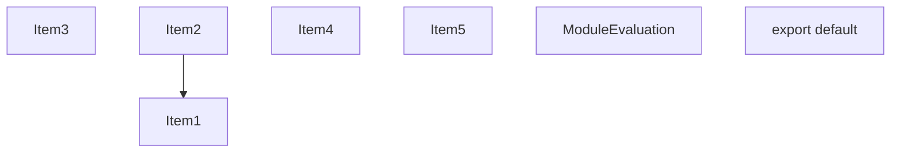
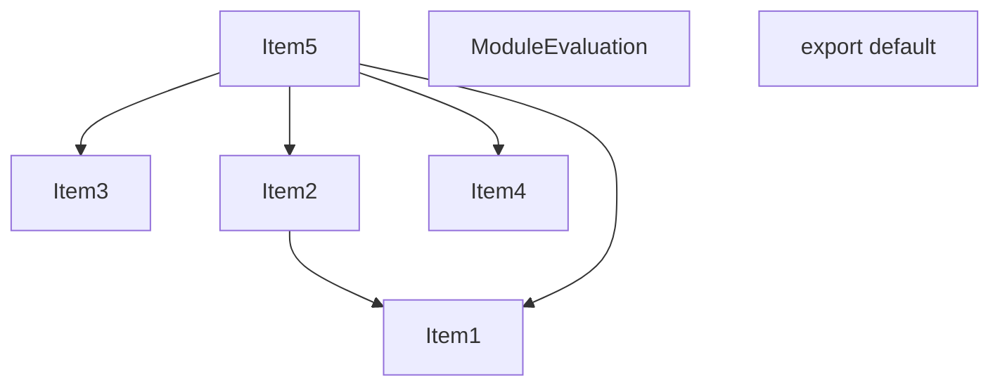
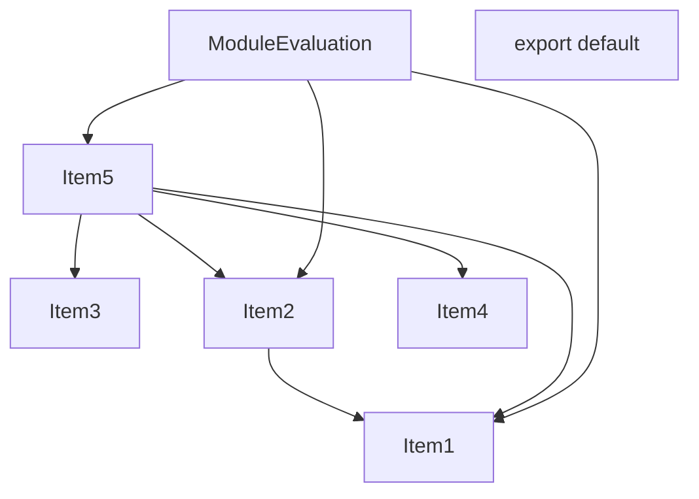
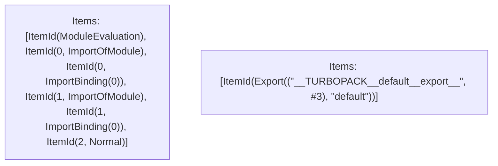

# Items

Count: 7

## Item 1: Stmt 0, `ImportOfModule`

```js
import { hoist } from './helpers';

```

- Hoisted
- Side effects

## Item 2: Stmt 0, `ImportBinding(0)`

```js
import { hoist } from './helpers';

```

- Hoisted
- Declares: `hoist`

## Item 3: Stmt 1, `ImportOfModule`

```js
import * as userland from 'VAR_USERLAND';

```

- Hoisted
- Side effects

## Item 4: Stmt 1, `ImportBinding(0)`

```js
import * as userland from 'VAR_USERLAND';

```

- Hoisted
- Declares: `userland`

## Item 5: Stmt 2, `Normal`

```js
export default hoist(userland, 'default');

```

- Side effects
- Declares: `__TURBOPACK__default__export__`
- Reads: `hoist`, `userland`

# Phase 1

# Phase 2

# Phase 3

# Phase 4

# Final

# Entrypoints

```
{
    ModuleEvaluation: 0,
    Export(
        "default",
    ): 1,
}
```


# Modules (dev)
## Part 0
```js
"module evaluation";
import './helpers';
import { hoist } from './helpers';
import 'VAR_USERLAND';
import * as userland from 'VAR_USERLAND';
export default hoist(userland, 'default');

```
## Part 1
```js
export { __TURBOPACK__default__export__ as default };

```
## Merged (module eval)
```js
import './helpers';
import { hoist } from './helpers';
import 'VAR_USERLAND';
import * as userland from 'VAR_USERLAND';
"module evaluation";
export default hoist(userland, 'default');

```
# Entrypoints

```
{
    ModuleEvaluation: 0,
    Export(
        "default",
    ): 1,
}
```


# Modules (prod)
## Part 0
```js
"module evaluation";
import './helpers';
import { hoist } from './helpers';
import 'VAR_USERLAND';
import * as userland from 'VAR_USERLAND';
export default hoist(userland, 'default');

```
## Part 1
```js
export { __TURBOPACK__default__export__ as default };

```
## Merged (module eval)
```js
import './helpers';
import { hoist } from './helpers';
import 'VAR_USERLAND';
import * as userland from 'VAR_USERLAND';
"module evaluation";
export default hoist(userland, 'default');

```
