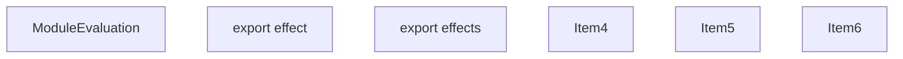
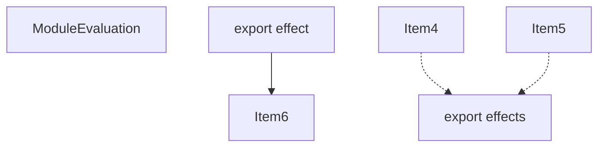
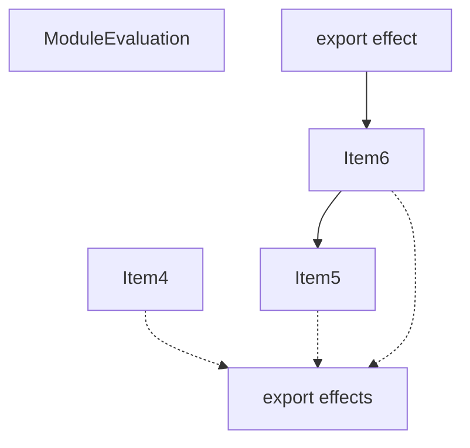
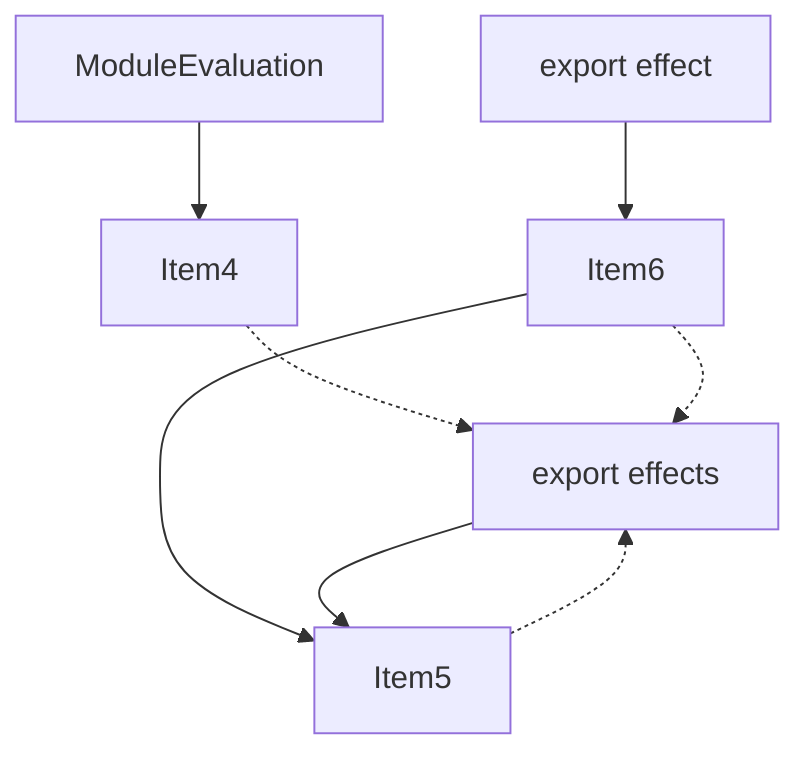
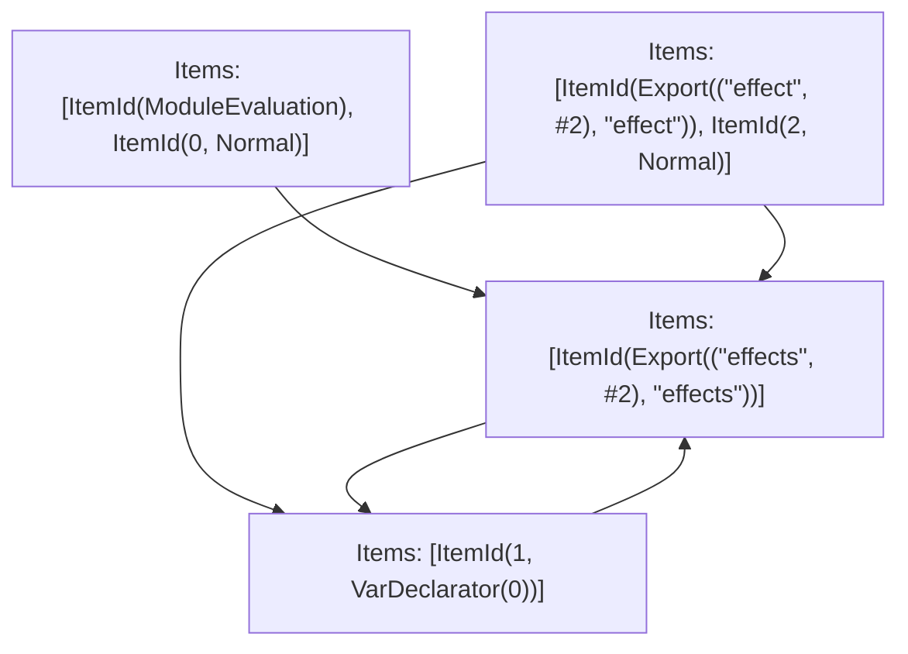

# Items

Count: 6

## Item 4: Stmt 0, `Normal`

```js
await Promise.resolve();

```

- Side effects

## Item 5: Stmt 1, `VarDeclarator(0)`

```js
export const effects = [];

```

- Declares: `effects`
- Write: `effects`

## Item 6: Stmt 2, `Normal`

```js
export function effect(name) {
    effects.push(name);
}

```

- Hoisted
- Declares: `effect`
- Reads (eventual): `effects`
- Write: `effect`
- Write (eventual): `effects`

# Phase 1

# Phase 2

# Phase 3

# Phase 4

# Final

# Entrypoints

```
{
    ModuleEvaluation: 0,
    Export(
        "effect",
    ): 1,
    Export(
        "effects",
    ): 2,
}
```


# Modules (dev)
## Part 0
```js
import "__TURBOPACK_PART__" assert {
    __turbopack_part__: 2
};
"module evaluation";
await Promise.resolve();

```
## Part 1
```js
import { effects } from "__TURBOPACK_PART__" assert {
    __turbopack_part__: 3
};
import "__TURBOPACK_PART__" assert {
    __turbopack_part__: 2
};
export { effect };
function effect(name) {
    effects.push(name);
}
export { effect } from "__TURBOPACK_VAR__" assert {
    __turbopack_var__: true
};

```
## Part 2
```js
import { effects } from "__TURBOPACK_PART__" assert {
    __turbopack_part__: 3
};
export { effects };

```
## Part 3
```js
import "__TURBOPACK_PART__" assert {
    __turbopack_part__: 2
};
const effects = [];
export { effects } from "__TURBOPACK_VAR__" assert {
    __turbopack_var__: true
};

```
## Merged (module eval)
```js
import "__TURBOPACK_PART__" assert {
    __turbopack_part__: 2
};
"module evaluation";
await Promise.resolve();

```
# Entrypoints

```
{
    ModuleEvaluation: 0,
    Export(
        "effect",
    ): 1,
    Export(
        "effects",
    ): 2,
}
```


# Modules (prod)
## Part 0
```js
"module evaluation";
await Promise.resolve();

```
## Part 1
```js
import { effects } from "__TURBOPACK_PART__" assert {
    __turbopack_part__: 3
};
export { effect };
function effect(name) {
    effects.push(name);
}
export { effect } from "__TURBOPACK_VAR__" assert {
    __turbopack_var__: true
};

```
## Part 2
```js
import { effects } from "__TURBOPACK_PART__" assert {
    __turbopack_part__: 3
};
export { effects };

```
## Part 3
```js
const effects = [];
export { effects } from "__TURBOPACK_VAR__" assert {
    __turbopack_var__: true
};

```
## Merged (module eval)
```js
"module evaluation";
await Promise.resolve();

```
