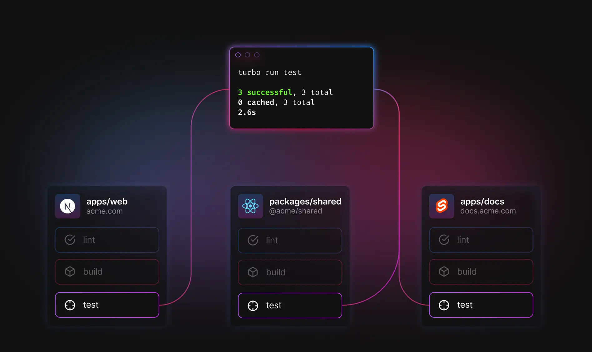
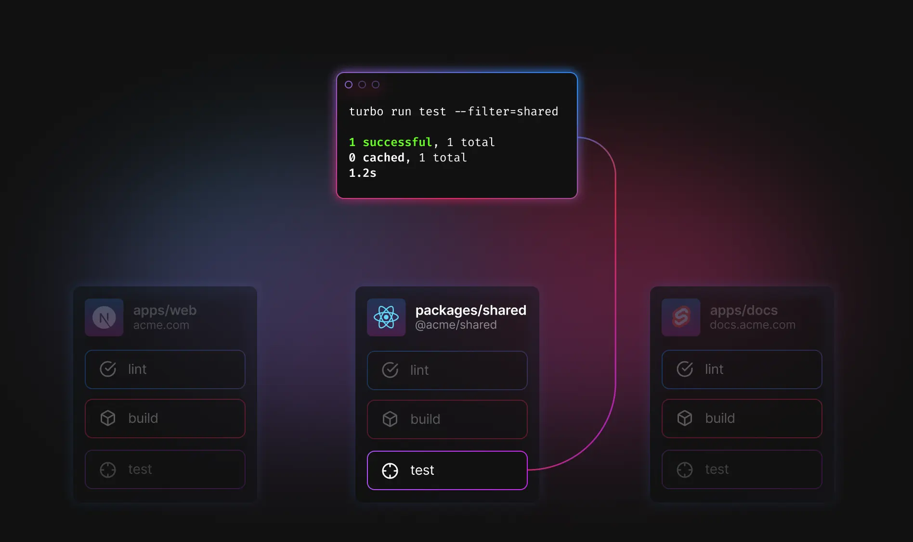

import Callout from "../../../components/Callout";
import HeartIcon from "@heroicons/react/solid/HeartIcon";

# Filtering Workspaces

A monorepo can contain hundreds, or thousands, of workspaces. By default, running `turbo run test` will execute the `test` task in **all available workspaces**.



Turborepo supports a `--filter` flag that lets you **select the workspaces you'd like to execute your task in**.



You can use it to:

- Filter by [workspace name](#filter-by-workspace-name)
- Filter by [workspace directory](#filter-by-directory)
- Include [dependents](#include-dependents-of-matched-workspaces) and [dependencies](#include-dependencies-of-matched-workspaces) of matched workspaces
- Execute tasks from the [workspace root](#the-workspace-root)
- Filter by [changes in git history](#filter-by-changed-workspaces)
- [Exclude workspaces](#excluding-workspaces) from selection

Turborepo will run each task against each matched workspace, ensuring that any dependent tasks are run first, according to the `pipeline` specification in [`turbo.json`](/docs/reference/configuration#pipeline).

## Filter Syntax

### Multiple filters

You can specify more than one filter by passing multiple `--filter` flags to the command:

```sh
turbo run build --filter=my-pkg --filter=my-app
```

### Filter by workspace name

Supports exact matches (`--filter=my-pkg`), and globs (`--filter=*my-pkg*`).

```sh
# Build 'my-pkg', letting `turbo` infer task dependencies
# from the pipeline defined in turbo.json
turbo run build --filter=my-pkg

# Build '@acme/bar', letting `turbo` infer task dependencies
# from the pipeline defined in turbo.json
turbo run build --filter=@acme/bar

# Build all workspaces that start with 'admin-', letting turbo infer task
# dependencies from the pipeline defined in turbo.json
turbo run build --filter=admin-*
```

#### Scopes

Some monorepos prepend their workspace names with a scope, such as `@acme/ui` and `@acme/app`. As long as the scope (`@acme`) is unique across the codebase, you may omit it from filters.

```diff
- turbo run build --filter=@acme/ui
+ turbo run build --filter=ui
```

### Include dependents of matched workspaces

If `my-app` depends on `my-lib`, `...my-lib` will select `my-app` and `my-lib`.

Including a `^` (`...^my-lib`) will select all of `my-lib`'s dependents, but not `my-lib` itself.

```sh
# Test 'my-lib' and everything that depends on 'my-lib'
turbo run test --filter=...my-lib

# Test everything that depends on 'my-lib', but not 'my-lib' itself
turbo run test --filter=...^my-lib
```

### Include dependencies of matched workspaces

Append `...` to the end of the filter. If `my-app` depends on `my-lib`, `my-app...` will select `my-app` and `my-lib`.

Including a `^` (`my-app^...`) will select all of `my-app`'s dependencies, but not `my-app` itself.

```sh
# Build 'my-app' and its dependencies
turbo run build --filter=my-app...

# Build 'my-app's dependencies, but not 'my-app' itself
turbo run build --filter=my-app^...
```

### Filter by directory

Supports:

- Exact matches: `--filter=./apps/docs`
- Globs: `--filter=./apps/*`

```sh
# Build all of the workspaces in the 'apps' directory
turbo run build --filter=./apps/*
```

#### Combining with other syntaxes

When combining directory filters with other syntaxes, enclose in `{}`. For example:

```sh
# Build all of the workspaces in the 'libs' directory,
# and all the workspaces that depends on them
turbo run build --filter=...{./libs/*}
```

### Filter by changed workspaces

Use the set of files changed since a specified commit to calculate workspaces. Enclose references in `[]`.

For example, `--filter=[HEAD^1]` will select all workspaces that have changed in the most recent commit:

```sh
# Test everything that changed in the last commit
turbo run test --filter=[HEAD^1]
```

#### Check a range of commits

If you need to check a specific range of commits, rather than comparing to `HEAD`, you can set
both ends of the comparison via `[<from commit>...<to commit>]`.

```sh
# Test each workspace that changed between 'main' and 'my-feature'
turbo run test --filter=[main...my-feature]
```

#### Ignoring changed files

You can use [`--ignore`](/docs/reference/command-line-reference#--ignore) to specify changed files to be ignored in the calculation of which workspaces have changed.

{/* TODO */}

#### Combining with other syntaxes

You can additionally prepend the commit reference with `...` to match the dependencies of other components
against the changed workspaces. For instance, to select `foo` if any of `foo`'s dependencies have changed in the last commit,
you can pass `--filter=foo...[HEAD^1]`.

```sh
# Build everything that depends on changes in branch 'my-feature'
turbo run build --filter=...[origin/my-feature]

# Build '@foo/bar' if it or any of its dependencies
# changed in the last commit
turbo run build --filter=@foo/bar...[HEAD^1]
```

You can even combine `[]` and `{}` syntax together:

```sh
# Test each workspace in the '@scope' scope that
# is in the 'packages' directory, if it has
# changed in the last commit
turbo run test --filter=@scope/*{./packages/*}[HEAD^1]
```

### The workspace root

The monorepo's root can be selected using the token `//`.

```sh
# Run the format script from the root "package.json" file:
turbo run format --filter=//
```

### Excluding workspaces

Prepend `!` to the filter. Matched workspaces from the entire filter will be excluded from the set of targets.
For example, match everything except `@foo/bar`: `--filter=!@foo/bar`. Note that you may need to escape `!` as appropriate for your shell (e.g. `\!`).

```sh
# Build everything except '@foo/bar'
turbo run build --filter=!@foo/bar
# Build all of the workspaces in the 'apps' directory, except the 'admin' workspace
turbo run build --filter=./apps/* --filter=!admin
```

<Callout type="idea" icon={<HeartIcon className="mt-1 h-5 w-5 text-gray-400" aria-hidden="true" />}>
Turborepo's Filter API design and docs were/are inspired by [pnpm](https://pnpm.io/filtering)
</Callout>
