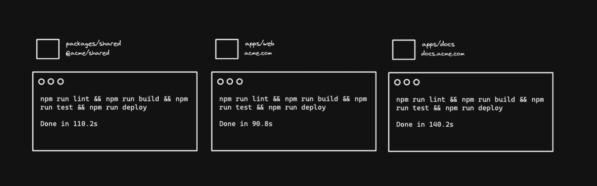
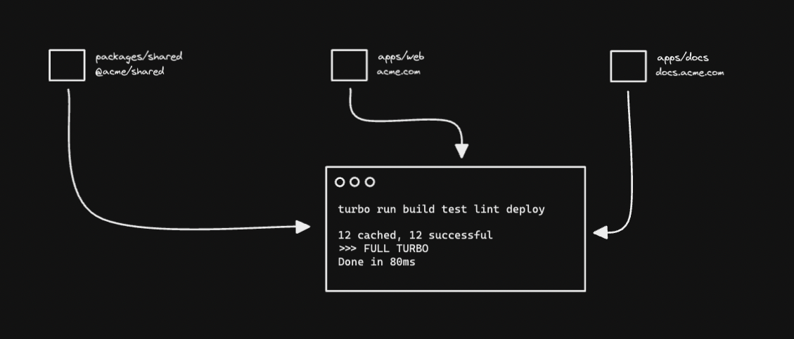

# Turborepo in Monorepos

## The problem

Monorepos have many advantages - but **they struggle to scale**. Each workspace has its own test suite, its own linting and its own build process. A single monorepo might have **hundreds of tasks to execute**.

## The solution

**Turborepo solves your monorepo's scaling problem**. Our remote cache stores the result of all your tasks, meaning that **your CI never needs to do the same work twice**.

Task scheduling can be difficult in a monorepo. Imagine `yarn build` needs to run before `yarn test`, across all your workspaces. Turborepo **can schedule your tasks for maximum speed**, across all available cores.

Turborepo can be **adopted incrementally**. It uses the `package.json` scripts you've already written, the dependencies you've already declared, and a single `turbo.json` file. You can **use it with any package manager**, like `npm`, `yarn` or `pnpm`. You can add it to any monorepo in just a few minutes.

## What turborepo is not

Turborepo **doesn't handle [package installation](/repo/docs/handbook/package-installation)**. Tools like `npm`, `pnpm` or `yarn` already do that brilliantly. But they run tasks inefficiently, meaning slow CI builds.

We recommend that **Turborepo runs your tasks**, and your favorite package manager installs your packages.
