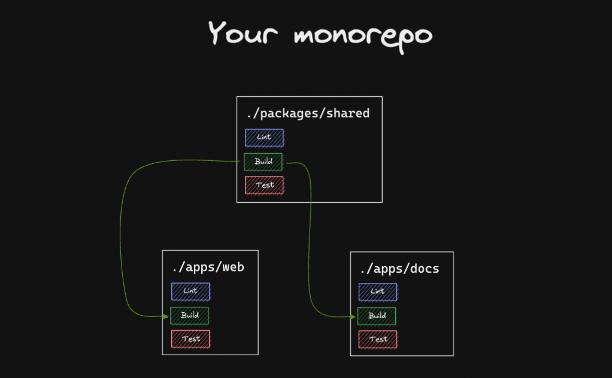
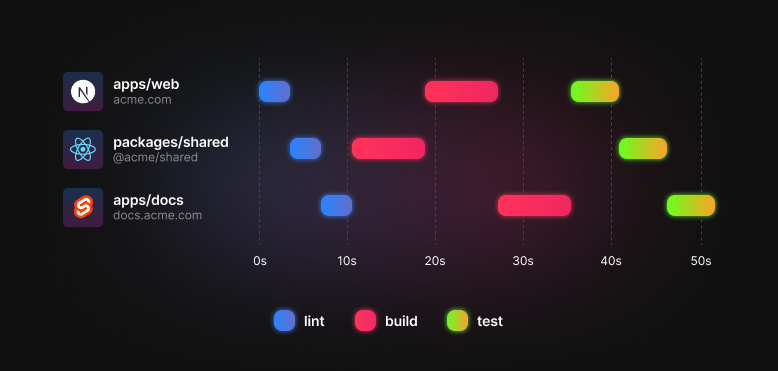
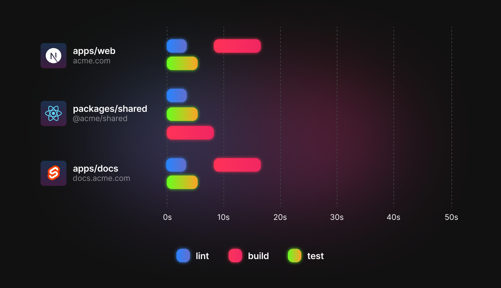

import Callout from "../../../../../components/Callout";
import HeartIcon from "@heroicons/react/solid/HeartIcon";

# Running Tasks in a Monorepo

Every monorepo has two main building blocks: **workspaces** and **tasks**. Let's imagine you have a monorepo containing **three workspaces**, each with **three tasks**:



Here, both `apps/web` and `apps/doc` use code from `packages/shared`. In fact, when they're built (via `build`) **they need `packages/shared` to be built _first_**.

## Most tools don't optimize for speed

Let's imagine we want to run all our tasks across all our workspaces. In a tool like `yarn`, you might run a script like this:

```
yarn workspaces run lint
yarn workspaces run test
yarn workspaces run build
```

This would mean the tasks run like this:



As you can see, `lint` gets run in all the workspaces. Then, `build` gets run - with `shared` going first. Finally, `test` gets run.

**This is the slowest possible way to run these tasks**. Each task needs to wait for the previous one to finish before it can start. To improve on this, we'll need a tool that can multitask.

## Turborepo can multitask

Turborepo can schedule our tasks for maximum speed by understanding the dependencies between our tasks.

First, we declare our tasks inside `turbo.json`:

```json
{
  "$schema": "https://turborepo.org/schema.json",
  "pipeline": {
    "build": {
      // ^build means build must be run in dependencies
      // before it can be run in this workspace
      "dependsOn": ["^build"]
    },
    "test": {
      "outputs": []
    },
    "lint": {
      "outputs": []
    }
  }
}
```

Next, we can replace our `yarn workspaces` script with this:

```diff
- yarn workspaces run lint
- yarn workspaces run test
- yarn workspaces run build
+ turbo run lint test build
```

When we run it, Turborepo will **multitask as many tasks as possible over all available CPU's**, meaning our tasks run like this:



Both `lint` and `test` run immediately, because they have no `dependsOn` specified in `turbo.json`.

The `build` task inside `shared` completes first, then `web` and `docs` build afterwards.

## Defining a pipeline

The `pipeline` configuration declares which tasks depend on each other in your monorepo. Here's a kitchen sink example:

```diff
{
  "$schema": "https://turborepo.org/schema.json",
  "pipeline": {
    "build": {
+      // A workspace's `build` task depends on that workspace's
+      // topological dependencies' and devDependencies'
+      // `build` tasks  being completed first. The `^` symbol
+      // indicates an upstream dependency.
      "dependsOn": ["^build"]
    },
    "test": {
+      // A workspace's `test` task depends on that workspace's
+      // own `build` task being completed first.
      "dependsOn": ["build"],
      "outputs": [],
+      // A workspace's `test` task should only be rerun when
+      // either a `.tsx` or `.ts` file has changed.
      "inputs": ["src/**/*.tsx", "src/**/*.ts", "test/**/*.ts", "test/**/*.tsx"]
    },
    "lint": {
+      // A workspace's `lint` task has no dependencies and
+      // can be run whenever.
      "outputs": []
    },
    "deploy": {
+      // A workspace's `deploy` task depends on the `build`,
+      // `test`, and `lint` tasks of the same workspace
+      // being completed.
      "dependsOn": ["build", "test", "lint"],
      "outputs": []
    }
  }
}
```

Let's walk through some common patterns you'll want to get to know before diving in to `turbo.json`.

### Dependencies between tasks

#### In the same workspace

There might be tasks which need to run _before_ other tasks. For instance, `build` might need to be run before `deploy`.

If both tasks are in the same workspace, you can specify the relationship like this:

```json filename="turbo.json"
{
  "$schema": "https://turborepo.org/schema.json",
  "pipeline": {
    "build": {},
    "deploy": {
      // A workspace's `deploy` task depends on the `build`,
      // task of the same workspace being completed.
      "dependsOn": ["build"],
      "outputs": []
    }
  }
}
```

This means that whenever `turbo run deploy` is run, `build` will also be run inside the same workspace.

#### In a different workspace

A common pattern in monorepos is to declare that a workspace's `build` task should only run once the `build` tasks of all _the workspaces it depends on_ are complete.

The `^` symbol explicitly declares that the task has a dependency on a task in a workspace it depends on.

```jsonc filename="turbo.json"
{
  "$schema": "https://turborepo.org/schema.json",
  "pipeline": {
    "build": {
      // "A workspace's `build` command depends on its dependencies'
      // and devDependencies' `build` commands being completed first"
      "dependsOn": ["^build"]
    }
  }
}
```

#### No dependencies

An empty dependency list (`dependsOn` is either undefined or `[]`) means that nothing needs to run before this task! After all, it has NO dependencies.

```jsonc
{
  "$schema": "https://turborepo.org/schema.json",
  "pipeline": {
    "lint": {
      // A workspace's `lint` command has no dependencies and can be run
      // whenever.
      "outputs": []
    }
  }
}
```

#### Specific workspace-tasks

Sometimes, you may want to create a workspace-task dependency on another workspace-task. This can be especially helpful for repos migrating from `lerna` or `rush`, where tasks are run in separate phases by default. Sometimes these configurations make assumptions that cannot be expressed in a simple `pipeline` configuration, as seen above. Or you may just want to express sequences of tasks between applications or microservices when using `turbo` in CI/CD.

For these cases, you can express these relationships in your `pipeline` configuration using the `<workspace>#<task>` syntax.
The example below describes the `deploy` script of a `frontend` application that depends on the `deploy` and `health-check` scripts of `backend`, as well as the `test` script of a `ui` workspace:

```jsonc
{
  "$schema": "https://turborepo.org/schema.json",
  "pipeline": {
    // Standard configuration
    "build": {
      "dependsOn": ["^build"]
    },
    "test": {
      "dependsOn": ["^build"],
      "outputs": []
    },
    "deploy": {
      "dependsOn": ["test", "build"],
      "outputs": []
    },

    // Explicit workspace-task to workspace-task dependency
    "frontend#deploy": {
      "dependsOn": ["ui#test", "backend#deploy", "backend#health-check"],
      "outputs": []
    }
  }
}
```

This explicit configuration for `frontend#deploy` may seem to conflict with the `test` and `deploy` task configurations, but it does not. Since `test` and `deploy` do not have dependencies on other workspaces (e.g. `^<task>`), they can execute any time after their workspace's `build` and `test` scripts have finished.

<Callout>
  Notes:

1. Although this `<workspace>#<task>` syntax is a useful escape hatch, we generally recommend using it for deployment orchestration tasks such as health checks, rather than build-time dependencies, so that Turborepo can optimize these tasks more efficiently
1. Package-tasks do not inherit cache configuration. You must redeclare
   [`outputs`](../reference/configuration#outputs) at the moment.
1. `<workspace>` must match the `name` key in the workspace's `package.json` or the task will be ignored.

</Callout>

### Running tasks from the root

`turbo` can run tasks that exist in the `package.json` file at the root of the monorepo.
These must be explicitly added to the pipeline configuration using the key syntax `"//#<task>"`. This is
true even for tasks that already have their own entry. For example, if your pipeline declares a `"build"` task,
and you want to include the `build` script defined in the monorepo's root `package.json` file with
`turbo run build`, you must opt the root into it by declaring `"//#build": {...}` in your configuration.
Conversely, you _do not_ need to define a generic `"my-task": {...}` entry if all you need is `"//#my-task": {...}`.

A sample pipeline that defines the root task `format` and opts the root into `test` might look like:

```jsonc
{
  "$schema": "https://turborepo.org/schema.json",
  "pipeline": {
    "build": {
      "dependsOn": ["^build"]
    },
    "test": {
      "dependsOn": ["^build"],
      "outputs": []
    },
    // This will cause the "test" script to be included when
    // "turbo run test" is run
    "//#test": {
      "dependsOn": [],
      "outputs": []
    },
    // This will cause the "format" script in the root package.json
    // to be run when "turbo run format" is run. Since the general
    // "format" task is not defined, only the root's "format" script
    // will be run.
    "//#format": {
      "dependsOn": [],
      "outputs": ["dist/**/*"],
      "inputs": ["version.txt"]
    }
  }
}
```

**A note on recursion**: Scripts defined in the monorepo's root `package.json` often call `turbo` themselves.
For example, the `build` script might be `turbo run build`. In this situation, including `//#build` in
`turbo run build` will cause infinite recursion. It is for this reason that tasks run from the monorepo's root must
be explicitly opted into via including `//#<task>` in the pipeline configuration. `turbo` includes
some best-effort checking to produce an error in the recursion situations, but it is up to you to to only
opt in those tasks which don't themselves trigger a `turbo` run that would recurse.

<Callout
  type="idea"
  icon={<HeartIcon className="h-5 w-5 mt-1 text-gray-400" aria-hidden="true" />}
>
  Turborepo's Pipeline API design and this page of documentation was inspired by
  [Microsoft's Lage
  project](https://microsoft.github.io/lage/docs/Tutorial/pipeline#defining-a-pipeline).
  Shoutout to [Kenneth Chau](https://twitter.com/kenneth_chau) for the idea of
  fanning out tasks in such a concise and elegant way.
</Callout>

### Tips

#### Tasks that are in the `pipeline` but not in SOME `package.json`

Sometimes tasks declared in the `pipeline` are not present in all workspaces' `package.json` files. `turbo` will gracefully ignore those. No problem!

#### `pipeline` tasks are the only ones that `turbo` knows about

`turbo` will only account for tasks declared in the `pipeline` configuration. If it's not listed there, `turbo` will not know how to run them.
