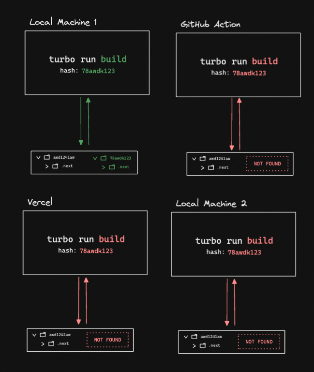
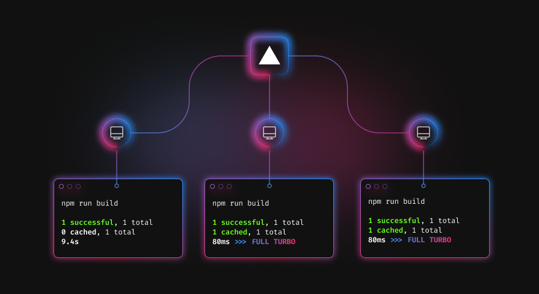

import Callout from "../../../../components/Callout";
import { Tabs, Tab } from "../../../../components/Tabs";

# Remote Caching

Turborepo's [task cache](/docs/core-concepts/caching) can save a lot of time by never doing the same work twice.

But there's an issue - the **cache is local to your machine**. When you're working with a CI, this can result in a lot of duplicated work:



Since Turborepo only caches to the local filesystem by default, the same task (`turbo run build`) must be **re-executed on each machine** (by you, by your teammates, by your CI, by your PaaS, etc.) even when all of the task inputs are identical — which **wastes time and resources**.

## A single, shared cache

What if you could share a single Turborepo cache across your entire team (and even your CI)?



By working with providers like [Vercel](#vercel), Turborepo can securely communicate with a remote cache - a cloud server that stores the results of your tasks.

This can save enormous amounts of time by **preventing duplicated work across your entire organization**.

<Callout>
  Remote Caching is a powerful feature of Turborepo, but with great power comes
  great responsibility. Make sure you are caching correctly first and double
  check handling of environment variables. Please also remember Turborepo treats
  logs as artifacts, so be aware of what you are printing to the console.
</Callout>

## Vercel

### For Local Development

If you want to link your local turborepo to your Remote Cache, first authenticate the Turborepo CLI with your Vercel account:

```sh
npx turbo login
```

Next, link your Turborepo to your remote cache:

```sh
npx turbo link
```

Once enabled, make some changes to a workspace you are currently caching and run tasks against it with `turbo run`.
Your cache artifacts will now be stored locally _and_ in your Remote Cache.

To verify, delete your local Turborepo cache with:

<Tabs items={["unix", "win"]} storageKey="selected-os">
  <Tab>```sh rm -rf ./node_modules/.cache/turbo ```</Tab>
  <Tab>```sh rd /s /q "./node_modules/.cache/turbo" ```</Tab>
</Tabs>

Then run the same build again. If things are working properly, `turbo` should not execute tasks locally, but rather download both the logs and artifacts from your Remote Cache and replay them back to you.

### Remote Caching on Vercel Builds

If you are building and hosting your apps on Vercel, Remote Caching will be automatically set up on your behalf once you use `turbo`. You need to update your [build settings](https://vercel.com/docs/concepts/deployments/configure-a-build) to build with `turbo`.

Please refer to the [Vercel documentation](https://vercel.com/docs/concepts/git/monorepos#turborepo?utm_source=turbo.build&utm_medium=referral&utm_campaign=docs-link) for instructions.

### Artifact Integrity and Authenticity Verification

You can enable Turborepo to sign artifacts with a secret key before uploading them to the Remote Cache. Turborepo uses `HMAC-SHA256` signatures on artifacts using a secret key you provide.
Turborepo will verify the remote cache artifacts' integrity and authenticity when they're downloaded.
Any artifacts that fail to verify will be ignored and treated as a cache miss by Turborepo.

To enable this feature, set the `remoteCache` options on your `turbo.json` config to include `signature: true`. Then specify your secret key by declaring the `TURBO_REMOTE_CACHE_SIGNATURE_KEY` environment variable.

```jsonc
{
  "$schema": "https://turborepo.org/schema.json",
  "remoteCache": {
    // Indicates if signature verification is enabled.
    "signature": true
  }
}
```

## Custom Remote Caches

You can self-host your own Remote Cache or use other remote caching service providers as long as they comply with Turborepo's Remote Caching Server API.

You can set the remote caching domain by specifying the `--api` and `--token` flags, where `--api` is the hostname and `--token` is a bearer token.

```sh
turbo run build --api="https://my-server.example.com" --token="xxxxxxxxxxxxxxxxx"
```

You can see the endpoints / requests [needed here](https://github.com/vercel/turbo/blob/main/cli/internal/client/client.go).
