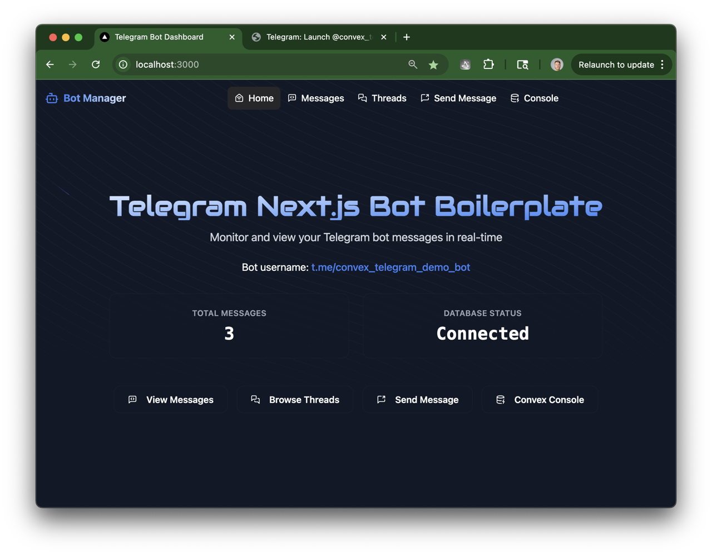
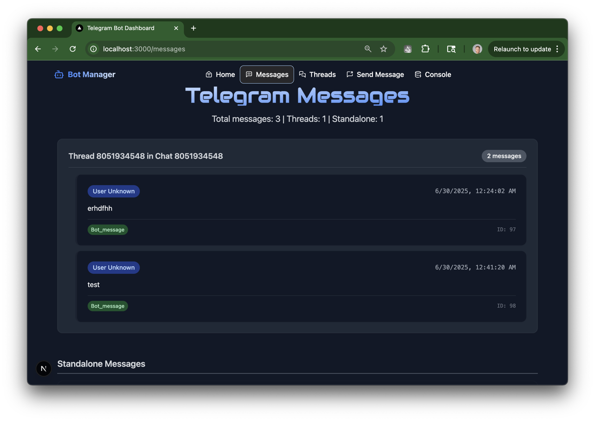
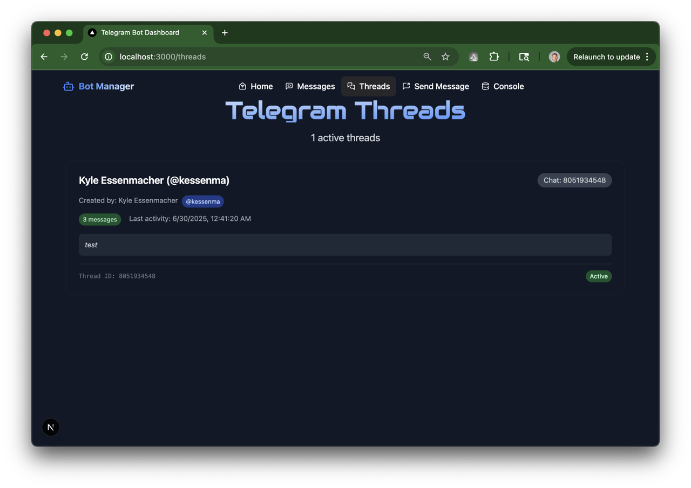
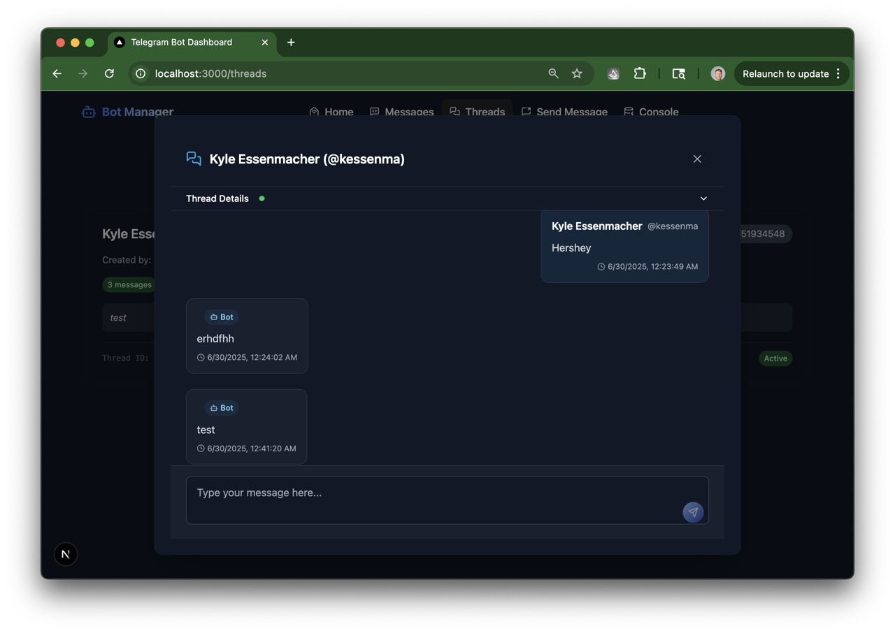
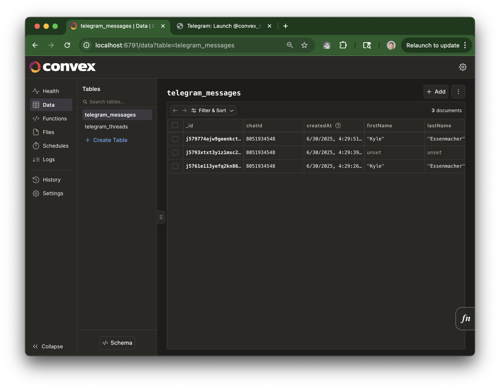
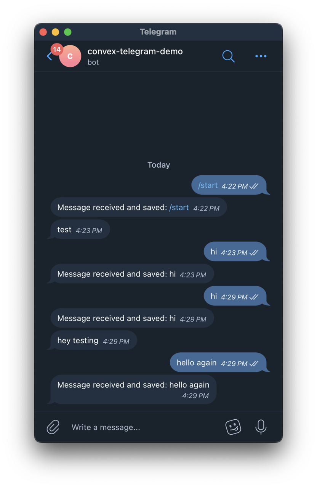
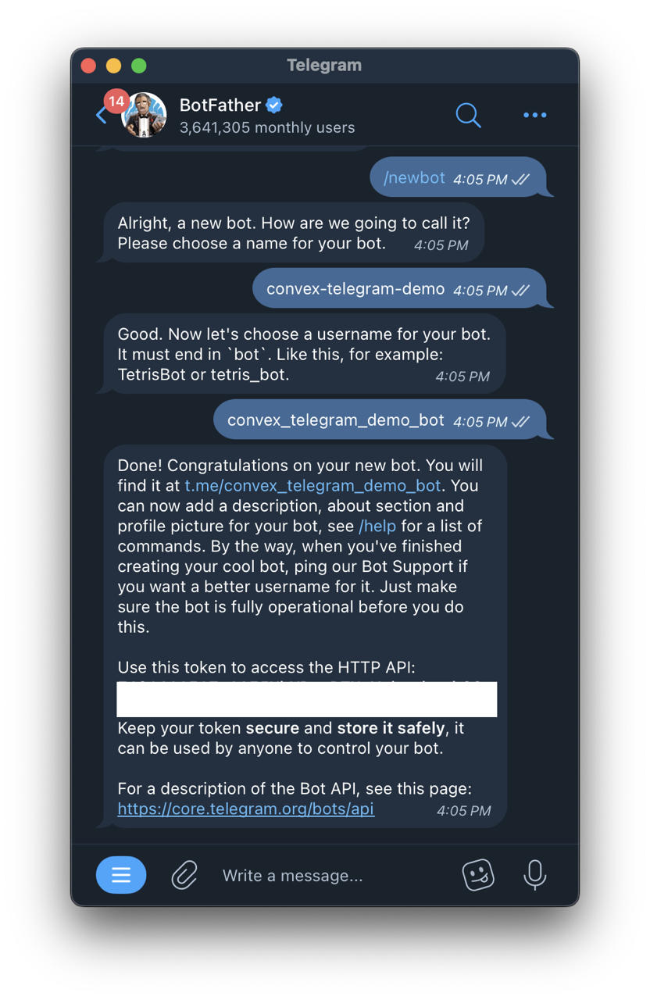
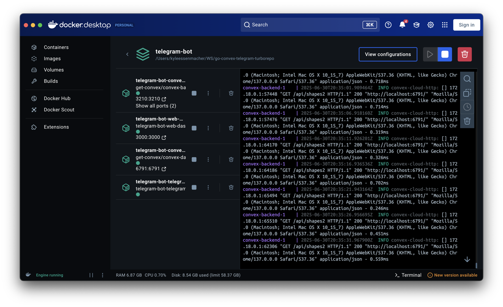

# Telegram Bot + Convex Backend Turborepo

A [Turborepo](https://turbo.build/repo) monorepo setup that connects a Golang Telegram bot 🤖 with a self-hosted Convex database backend, and a next.js web app.

## 🧱 The building blocks

- ** Turborepo** - A monorepo management tool that orchestrates the project from a central package.json and .env
- **a central Docker compose** - Used to define and run multi-container Docker applications (🧩every app in the apps folder has a dockerfile inside it🧩)
- ** a docker network** - Used to connect the containers securely (managed in the docker-compose.yaml)
- **Golang Telegram Bot** (`apps/golang-telegram-bot/`) - Receives messages and saves them to Convex
- **Convex Backend** (`apps/docker-convex/`) - Self-hosted typescript-based database with HTTP API endpoints
- **Convex console Next.js web app** (`apps/docker-convex/convex/`) - a Convex database manager app that requires an admin key to login with. the command is: `get-admin-key` (only can run when the convex backend is running in docker)
- **Next.js web app** (`apps/web/`) - Next.js frontend that displays messages from the Telegram bot and allows you to send messages back to the bot.
- **Shared Packages** (`packages/`) - Shared UI components and configurations

<table>  
<tr>
<td></td>
<td></td>
<td></td>
<td></td>
</tr>
</table>

<table>
<tr>
<td></td>
<td></td>
<td></td>
<td></td>
<td></td>
</tr>
</table>

## App Screenshots

What the combined Infrastrcture looks like:

<table>
<tr>
<td align="center">

<br><b>Next.js Home Page</b>
</td>
<td align="center">

<br><b>Messages Dashboard</b>
</td>
</tr>
<tr>
<td align="center">

<br><b>Threads Overview</b>
</td>
<td align="center">

<br><b>Thread Detail View</b>
</td>
</tr>
<tr>
<td align="center">

<br><b>Convex Database Console</b>
</td>
<td align="center">

<br><b>Telegram Bot Chat</b>
</td>
</tr>
<tr>
<td align="center">

<br><b>Telegram API Key retrieval</b>
</td>
<td align="center">

<br><b>Simultaneous Docker Containers</b>
</td>
</tr>
</table>

## 🚀 Quick Start (Docker) 🐳

### Prerequisites

- [Docker](https://docs.docker.com/get-docker/)
- [Node.js 18+](https://nodejs.org/en) and [pnpm](https://pnpm.io/installation) (use homebrew if on mac)
- Telegram Bot _Token_ and Telegram bot _username_ from messaging [@BotFather](https://t.me/botfather)
- [Go](https://go.dev/doc/install) installed

### Three-Command (Docker) Setup

1.

```bash
# Clone and setup everything
git clone https://github.com/kessenma/go-convex-telegram-turborepo
```

2.

```bash
cd go-convex-telegram-turborepo
pnpm install
chmod +x setup-init.sh
```

3.

```bash
pnpm setup-init
```

## Turborepo & Build Caching

This project uses **Turborepo** for monorepo management and intelligent build caching:

### TurboRepo Benefits (compared to multiple repos)

- **Incremental Development**: Only rebuild what you've modified
- **Parallel Execution**: Run tasks across all apps simultaneously
- **One central .env file** instead of each repo using its own .env

### How It Works locally

```bash
# First build - everything builds from scratch
pnpm run build

# Second build - only changed apps rebuild
pnpm run build

# View what would be cached/rebuilt
pnpm turbo run build --dry-run
```

## Local Development (Without Docker)

For local development without Docker containers, see guide:

📖 **[Local Setup Guide](./LOCAL-SETUP-GUIDE.md)**

This includes:

- Setting up each service individually (generally speaking I only run the web app locally)
- Running development servers locally
- Building and testing without containers
- Turborepo commands for local development

## 🐳 Docker Development

Run

```bash
pnpm setup-init
```

The setup script will:

1. Create `.env` file from template
2. Start Convex backend
3. Generate admin keys
4. Deploy Convex functions
5. Start all services

see [SETUP.md](./SETUP.md) for detailed setup instructions.

# Manage individual services interactively

once you have the docker containers running you can manage them with this custom helper script:

```bash
chmod +x docker-manager.sh
pnpm docker:manage
```

## Environmnent variable management

Every app in this repo contains a readme file to run the app independently from the monorepo. However, **‼️ in order to run the apps independently locally they will need their own env file in the corresponding app folder ‼️** Getting environment variables to play nice across monorepo's can be tricky, so I prefer to use a central .env file that can be used across the monorepo and relying on turborepo to centrally deploy apps from the central package.json.

## 🗂️ Project Structure

```bash
├── apps/
│   ├── docker-convex/          # Convex backend
│   │   ├── convex/
│   │   │   ├── schema.ts       # Database schema
│   │   │   ├── telegram.ts     # Telegram functions
│   │   │   └── http.ts         # HTTP API routes
│   │   └── docker-compose.yml  # Original Convex setup
│   ├── golang-telegram-bot/    # Telegram bot
│   │   ├── main.go             # Bot implementation
│   │   └── Dockerfile          # Bot container
│   └── web/                    # Next.js app
│   │   └── package.json        # Next.js web dev scripts
│   │   └── Dockerfile          # How the web app connects to the central docker-compose.yaml and central .env
│   │   └── home
│   │   └── messages
│   │   └── message threads
│   │   └── send message
│   │   └── convex dashboard connection steps
├── packages/                   # Shared packages (not used really)
│   ├── ui/                     # Shared UI components (not used)
│   ├── eslint-config/          # ESLint configurations (idk if used)
│   └── typescript-config/      # TypeScript configurations (idk if used)
├── docker-compose.yml          # Centralized Docker setup to control all the docekrfile's
├── .env.example                # Environment template
├── setup.sh                    # Automated setup script
└── SETUP.md                    # Detailed setup guide
```

## Docker commands

```bash
pnpm docker:up          # Start all services
```

```bash
pnpm docker:down        # Stop all services
```

```bash
pnpm docker:logs        # View logs
```

```bash
pnpm docker:restart-bot # Restart just the bot
```

```bash
pnpm docker:build       # Rebuild and start
```

```bash
pnpm docker:reset       # Reset everything
```

## Convex functions

Deploy Convex functions (Convex as a database runs off typescript functions, which is one way how it is different than a traditional SQL database. you can add more functions as you need and i think of them as the "database schema".):

```bash
pnpm convex:deploy
```

## Testing

(there are no tests yet)

```bash
pnpm test:api           # Test API endpoints
```

## Traditional Turborepo commands

```bash
pnpm build              # Build all packages
```

```bash
pnpm dev                # Start development servers
```

```bash
pnpm lint               # Lint all packages
```

```bash
pnpm format             # Format code
```

## 🔴----🔫 API Endpoints

The Convex backend exposes these HTTP endpoints:

- `POST /api/telegram/messages/thread` - Save a new message + create thread if new telegram thread.
- `GET /api/telegram/messages` - Get all messages
- `GET /api/telegram/messages?chatId=123` - Get messages for specific chat
- `GET /api/health` - Health check

## 🗄️ Database Schema

The Convex backend uses a structured schema with two main tables:

### `telegram_messages`

- Message content and metadata
- User information (ID, username, name)
- Chat information
- Timestamps

### `telegram_threads`

- Thread metadata and status
- Creator information
- Message counts and timestamps

For detailed documentation of the schema, API endpoints, and real-time features, see the [Convex Backend Documentation](./apps/docker-convex/convex/README.md).

## 🔍 Monitoring & Debugging

```bash
# View service status
docker compose ps -a

# Check specific service logs
docker compose logs telegram-bot
docker compose logs convex-backend

# Test API health
curl http://localhost:3210/api/health

# View saved messages
curl http://localhost:3210/api/telegram/messages
```

## 🚨 Troubleshooting

Common issues:

1. **Bot not connecting to Convex**:

   - Check if Convex is healthy: `curl http://localhost:3210/api/health`
   - Verify network: `docker compose exec telegram-bot ping convex-backend`

2. **Functions not working**:

   - Redeploy: `pnpm convex:deploy`
   - Check admin key exists: `ls apps/docker-convex/admin-key/`

3. **Messages not saving**:
   - Check bot logs: `docker compose logs telegram-bot`
   - Test API directly: `curl -X POST http://localhost:3210/api/telegram/messages -H "Content-Type: application/json" -d '{"messageId":1,"chatId":123,"text":"test"}'`

For detailed troubleshooting, see [SETUP.md](./SETUP.md).

## 🔒 Security

- Change `CONVEX_INSTANCE_SECRET` for production
- Keep `TELEGRAM_TOKEN` secure
- Admin key file contains sensitive credentials
- Use Docker secrets for production

## 🤝 Contributing

This is a Turborepo monorepo with:

- TypeScript for type safety
- ESLint for code linting
- Prettier for code formatting
- Docker for containerization

## 📚 Learn More

- [Convex Documentation](https://docs.convex.dev/)
- [Telegram Bot API](https://core.telegram.org/bots/api)
- [Turborepo Documentation](https://turbo.build/repo/docs)
- [Docker Compose](https://docs.docker.com/compose/)
