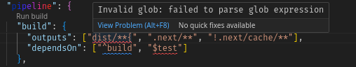
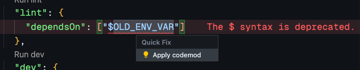

Enhance the experience in your Turborepo with faster feedback, repository discovery tooling, one-click task running, and more.

## Features

#### Understand and use your tasks faster

Find references for `turbo` tasks to quickly discover which `package.json` scripts will run. Then, run your pipeline with one click.

Every task in your pipeline can be followed to find its references.

#### Configuration help

Get instant feedback if you write incorrect globs, refer to non-existent packages or tasks, and more.

#### Contextual codemods

Get warned of deprecated syntax and run codemods to fix them with a click.

### Global `turbo` installer

We recommend you use turbo globally to simplify running commands. The extension will prompt you to install it if you don't already have it available.

### Daemon controls

Turborepo uses a background task to make your builds lightning fast. Rather than start it when you invoke turbo, we can instead start it when you launch your editor, keeping things snappy.

## Settings

- Override the auto-detection for your `turbo` binary if it fails or to use a different one.
